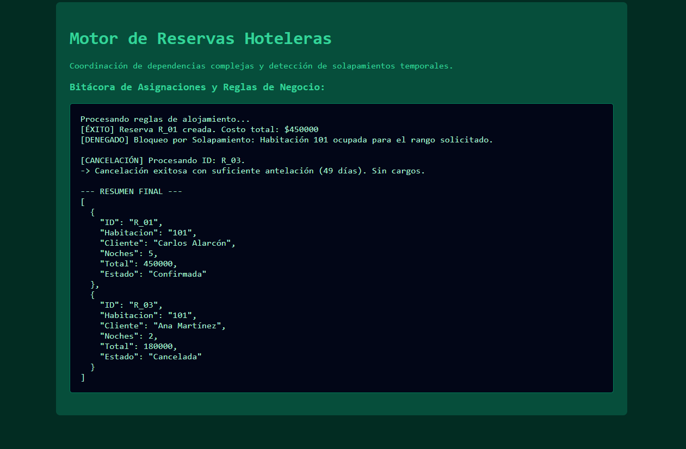

# Reto 58 - Sistema de rutas simple

## 🎯 Objetivo
Implementar un enrutador básico que muestre diferentes vistas sin recargar la página.

## 🛠️ Requisitos
- Navegador web moderno (Chrome, Firefox, Edge).
- [Visual Studio Code](https://code.visualstudio.com/) y Live Server (recomendado).

## ▶️ Cómo ejecutar
### 🌐 Usando Live Server
1. Abre la carpeta en VS Code y ejecuta con Live Server.
2. Navega entre las diferentes rutas usando los enlaces o botones.

## 🧠 Decisiones y proceso de solución
- Usé el evento hashchange para detectar cambios en la URL.
- Cada vista se renderiza dinámicamente ocultando y mostrando secciones.
- Mantuve un objeto de configuración con las rutas y sus vistas asociadas.

## ⚠️ Dificultades encontradas
- Tuve que evitar que los enlaces recargaran la página con preventDefault.
- Al principio olvidé manejar la ruta por defecto (404).
- Sincronizar el historial del navegador con pushState fue un reto adicional.

## ✅ Pruebas realizadas
- [x] Al cambiar la URL, se muestra la vista correspondiente.
- [x] La página no se recarga al navegar.
- [x] Una ruta no existente muestra un mensaje de error.
- [x] El botón "atrás" del navegador funciona correctamente.

## 📸 Evidencia
*Captura de pantalla del navegador después de ejecutar el reto.*

---

> **Nota:** Este reto forma parte del manual de JavaScript 2026. Desarrollado siguiendo los criterios de aceptación.
