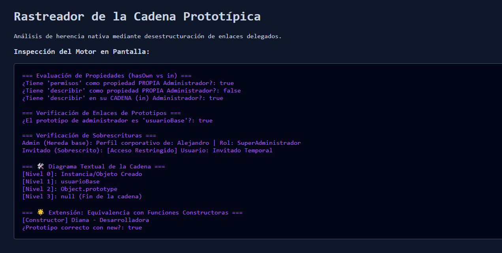

# Reto 59 - Carga de datos con AbortController

## 🎯 Objetivo
Implementar una búsqueda con fetch que cancele peticiones anteriores usando AbortController.

## 🛠️ Requisitos
- Navegador web moderno (Chrome, Firefox, Edge).
- [Visual Studio Code](https://code.visualstudio.com/) y Live Server (recomendado).

## ▶️ Cómo ejecutar
### 🌐 Usando Live Server
1. Abre la carpeta en VS Code y lanza Live Server.
2. Escribe en el campo de búsqueda y observa cómo se cancelan las peticiones antiguas.

## 🧠 Decisiones y proceso de solución
- Usé AbortController para cancelar peticiones fetch cuando el usuario escribe de nuevo.
- Implementé un debounce para no disparar demasiadas peticiones seguidas.
- Manejé el error de cancelación (AbortError) separadamente de otros errores de red.

## ⚠️ Dificultades encontradas
- Al principio no sabía que el AbortError debía ignorarse, no mostrarse como error.
- El debounce fue necesario para no saturar la API con cada tecla.
- Verificar que el controlador no se reutilizara después de abortar fue importante.

## ✅ Pruebas realizadas
- [x] Las peticiones anteriores se cancelan al escribir rápido.
- [x] Solo se muestra el resultado de la última búsqueda.
- [x] Los errores de red se muestran adecuadamente.
- [x] El AbortError no se muestra como error en la interfaz.

## 📸 Evidencia
*Captura de pantalla del navegador después de ejecutar el reto.*

---

> **Nota:** Este reto forma parte del manual de JavaScript 2026. Desarrollado siguiendo los criterios de aceptación.
