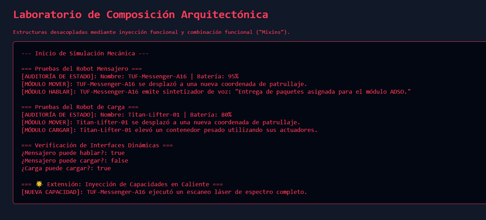

# Reto 60 - Autenticación simulada con JWT

## 🎯 Objetivo
Simular un flujo de login que almacena un token en sessionStorage y lo usa en peticiones.

## 🛠️ Requisitos
- Navegador web moderno (Chrome, Firefox, Edge).
- [Visual Studio Code](https://code.visualstudio.com/) y Live Server (recomendado).

## ▶️ Cómo ejecutar
### 🌐 Usando Live Server
1. Abre la carpeta en VS Code y lanza Live Server.
2. Usa el formulario de login (cualquier usuario/contraseña funciona).
3. Verifica que al recargar la página se mantenga la sesión.

## 🧠 Decisiones y proceso de solución
- Guardé el token simulado en sessionStorage para que persista durante la sesión.
- Todas las peticiones fetch incluyen el token en el encabezado Authorization.
- Si el token no existe o es inválido, redirijo al login.

## ⚠️ Dificultades encontradas
- Al principio guardaba el token en localStorage, pero por seguridad lo moví a sessionStorage.
- Tuve que interceptar las peticiones para añadir el token automáticamente.
- Manejar el estado "cargando" mientras se verifica el token fue más complejo de lo esperado.

## ✅ Pruebas realizadas
- [x] El login guarda el token y redirige al panel.
- [x] Recargar la página mantiene la sesión activa.
- [x] Cerrar la pestaña y reabrir cierra la sesión (sessionStorage).
- [x] Peticiones sin token son rechazadas.

## 📸 Evidencia
*Captura de pantalla del navegador después de ejecutar el reto.*

---

> **Nota:** Este reto forma parte del manual de JavaScript 2026. Desarrollado siguiendo los criterios de aceptación.
