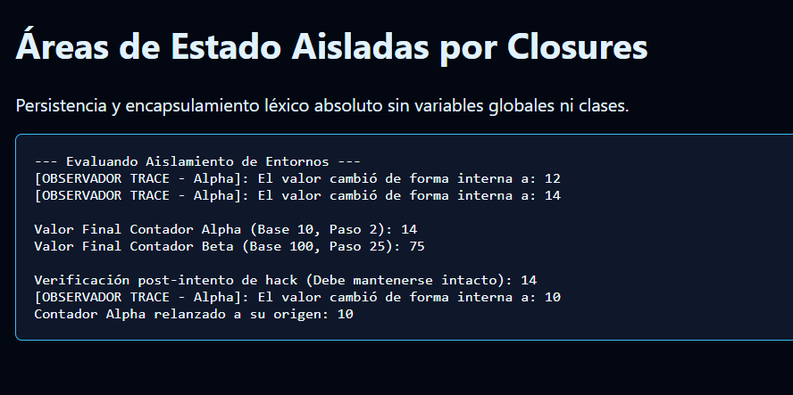

# Reto 61 - Caché de datos con Map

## 🎯 Objetivo
Implementar un sistema de caché en memoria usando Map para evitar peticiones repetidas.

## 🛠️ Requisitos
- Navegador web moderno (Chrome, Firefox, Edge).
- [Visual Studio Code](https://code.visualstudio.com/) y Live Server (recomendado).

## ▶️ Cómo ejecutar
### 🌐 Usando Live Server
1. Abre la carpeta en VS Code y lanza Live Server.
2. Realiza una búsqueda; la segunda vez que busques lo mismo será más rápido.

## 🧠 Decisiones y proceso de solución
- Usé un Map para almacenar resultados de búsquedas anteriores.
- Antes de hacer fetch, verifico si la clave ya existe en el caché.
- Implementé un tiempo de expiración simple para los datos cacheados.

## ⚠️ Dificultades encontradas
- Al principio el caché crecía sin control; añadí un límite máximo de entradas.
- Tuve que decidir si cachear también los errores (decidí no hacerlo).
- El Map con claves compuestas (query + filtros) fue más complejo de manejar.

## ✅ Pruebas realizadas
- [x] La primera búsqueda hace fetch; la segunda usa el caché.
- [x] Después del tiempo de expiración, los datos se refrescan.
- [x] El caché no guarda errores de red.
- [x] Al alcanzar el límite, se eliminan las entradas más antiguas.

## 📸 Evidencia
*Captura de pantalla del navegador después de ejecutar el reto.*

---

> **Nota:** Este reto forma parte del manual de JavaScript 2026. Desarrollado siguiendo los criterios de aceptación.
