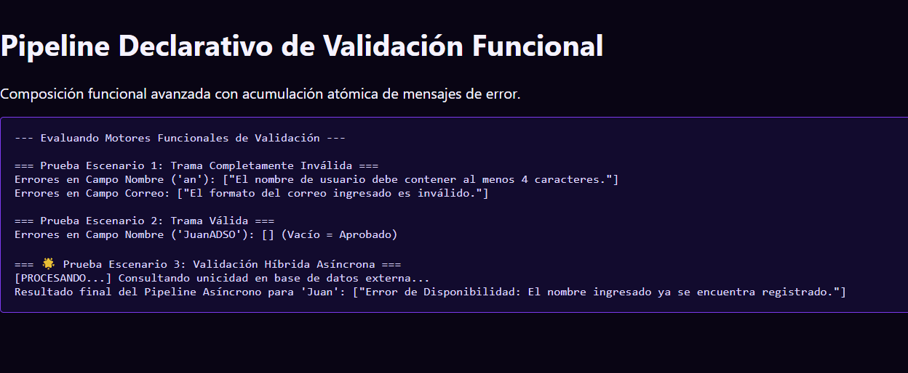

# Reto 62 - Notificaciones en tiempo real con setInterval

## 🎯 Objetivo
Simular notificaciones en tiempo real consultando un endpoint periódicamente.

## 🛠️ Requisitos
- Navegador web moderno (Chrome, Firefox, Edge).
- [Visual Studio Code](https://code.visualstudio.com/) y Live Server (recomendado).

## ▶️ Cómo ejecutar
### 🌐 Usando Live Server
1. Abre la carpeta en VS Code y lanza Live Server.
2. Espera unos segundos y aparecerán notificaciones simuladas.

## 🧠 Decisiones y proceso de solución
- Usé setInterval para consultar un endpoint cada 5 segundos.
- Almacené el ID del intervalo para limpiarlo cuando el usuario sale de la página.
- Las notificaciones se acumulan en una lista y el usuario puede marcarlas como leídas.

## ⚠️ Dificultades encontradas
- Si el intervalo no se limpia, sigue ejecutándose incluso después de cerrar la pestaña (en SPAs).
- La simulación de datos aleatorios me obligó a controlar que no se repitieran notificaciones.
- Manejar el foco de la pestaña para pausar las notificaciones fue un reto adicional.

## ✅ Pruebas realizadas
- [x] Las notificaciones aparecen periódicamente.
- [x] Al marcar como leída, desaparece de la lista de pendientes.
- [x] Si cambio de pestaña, el intervalo se pausa (si implementé el Page Visibility API).
- [x] Al recargar, las notificaciones anteriores se pierden (no persistidas).

## 📸 Evidencia
*Captura de pantalla del navegador después de ejecutar el reto.*

---

> **Nota:** Este reto forma parte del manual de JavaScript 2026. Desarrollado siguiendo los criterios de aceptación.
