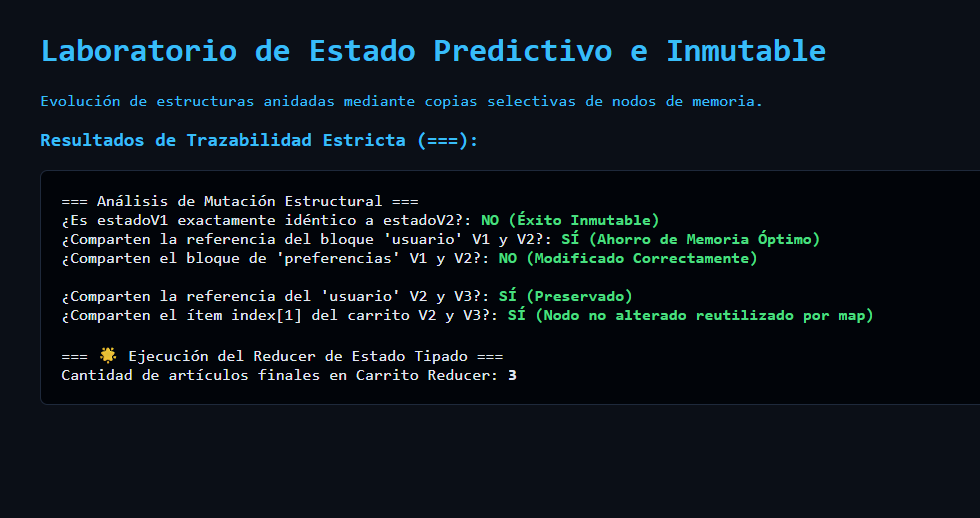

# Reto 63 - Drag and Drop de elementos

## 🎯 Objetivo
Implementar arrastrar y soltar (drag & drop) para reordenar una lista de elementos.

## 🛠️ Requisitos
- Navegador web moderno (Chrome, Firefox, Edge).
- [Visual Studio Code](https://code.visualstudio.com/) y Live Server (recomendado).

## ▶️ Cómo ejecutar
### 🌐 Usando Live Server
1. Abre la carpeta en VS Code y lanza Live Server.
2. Arrastra los elementos de la lista para reordenarlos.

## 🧠 Decisiones y proceso de solución
- Usé los eventos dragstart, dragover y drop para manejar el intercambio.
- Cada elemento arrastrable tiene un data-id para identificar su posición.
- Al soltar, reordeno el array en memoria y vuelvo a renderizar.

## ⚠️ Dificultades encontradas
- El evento dragover necesita preventDefault para permitir el drop.
- El estilo visual del elemento mientras se arrastra fue difícil de ajustar.
- Mantener sincronizado el array con el DOM después del drop requirió cuidado.

## ✅ Pruebas realizadas
- [x] Los elementos se pueden arrastrar y soltar en una nueva posición.
- [x] El orden visual coincide con el array después del drop.
- [x] Los elementos no se duplican ni desaparecen.
- [x] Funciona en navegadores modernos (Chrome, Firefox, Edge).

## 📸 Evidencia
*Captura de pantalla del navegador después de ejecutar el reto.*

---

> **Nota:** Este reto forma parte del manual de JavaScript 2026. Desarrollado siguiendo los criterios de aceptación.
