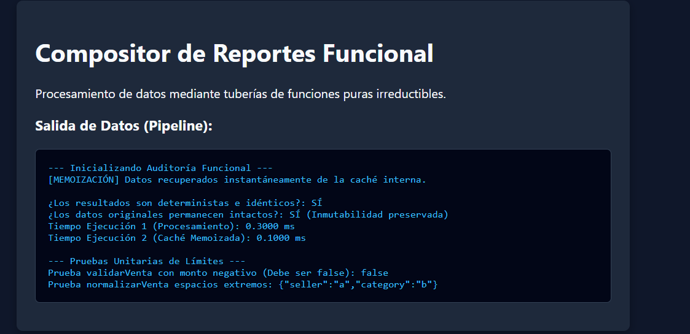

# Reto 64 - Carga de imágenes con lazy loading

## 🎯 Objetivo
Implementar carga diferida de imágenes (lazy loading) usando Intersection Observer.

## 🛠️ Requisitos
- Navegador web moderno (Chrome, Firefox, Edge).
- [Visual Studio Code](https://code.visualstudio.com/) y Live Server (recomendado).

## ▶️ Cómo ejecutar
### 🌐 Usando Live Server
1. Abre la carpeta en VS Code y lanza Live Server.
2. Desplázate por la página y observa cómo las imágenes se cargan al aparecer.

## 🧠 Decisiones y proceso de solución
- Usé Intersection Observer para detectar cuándo una imagen entra al viewport.
- Las imágenes tienen un atributo data-src con la URL real y un src placeholder.
- Cuando el observer se activa, reemplazo el placeholder por la imagen real.

## ⚠️ Dificultades encontradas
- El observer debe desconectarse después de cargar la imagen para no consumir recursos.
- Tuve que manejar imágenes que ya estaban visibles al cargar la página.
- El placeholder debía ser pequeño para no afectar el rendimiento.

## ✅ Pruebas realizadas
- [x] Las imágenes se cargan solo cuando aparecen en pantalla.
- [x] Las imágenes visibles inicialmente se cargan de inmediato.
- [x] Si una imagen tarda en cargar, se muestra un spinner.
- [x] No se disparan peticiones innecesarias al servidor.

## 📸 Evidencia
*Captura de pantalla del navegador después de ejecutar el reto.*

---

> **Nota:** Este reto forma parte del manual de JavaScript 2026. Desarrollado siguiendo los criterios de aceptación.
