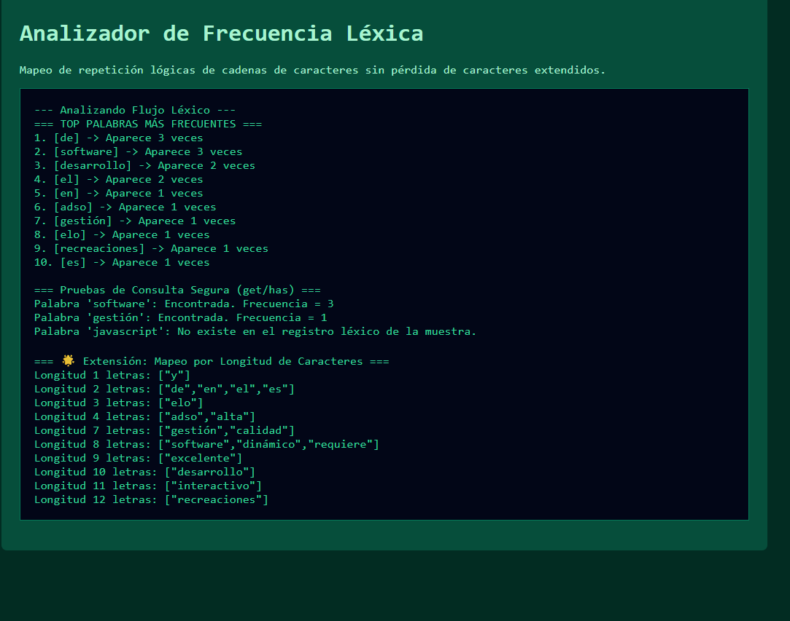

# Reto 65 - Formulario multietapa con validación

## 🎯 Objetivo
Crear un formulario dividido en pasos con validación en cada etapa y barra de progreso.

## 🛠️ Requisitos
- Navegador web moderno (Chrome, Firefox, Edge).
- [Visual Studio Code](https://code.visualstudio.com/) y Live Server (recomendado).

## ▶️ Cómo ejecutar
### 🌐 Usando Live Server
1. Abre la carpeta en VS Code y lanza Live Server.
2. Completa cada paso del formulario; la barra de progreso avanza.

## 🧠 Decisiones y proceso de solución
- Dividí el formulario en secciones (fieldsets) y mostré una a la vez.
- Validé cada paso antes de permitir avanzar al siguiente.
- Implementé una barra de progreso que refleja el paso actual.
- Los datos se acumulan en un objeto y al final se muestran o se envían.

## ⚠️ Dificultades encontradas
- Al principio la validación no detenía el avance si el campo estaba vacío.
- La barra de progreso requería actualizar clases CSS y atributos ARIA.
- Tuve que decidir si guardar los datos en sessionStorage (lo hice para no perder el avance).

## ✅ Pruebas realizadas
- [x] No se puede avanzar si el paso actual tiene errores.
- [x] La barra de progreso avanza correctamente.
- [x] Al llegar al final, se muestra el resumen de datos.
- [x] Los datos se guardan temporalmente en sessionStorage.

## 📸 Evidencia
*Captura de pantalla del navegador después de ejecutar el reto.*

---

> **Nota:** Este reto forma parte del manual de JavaScript 2026. Desarrollado siguiendo los criterios de aceptación.
