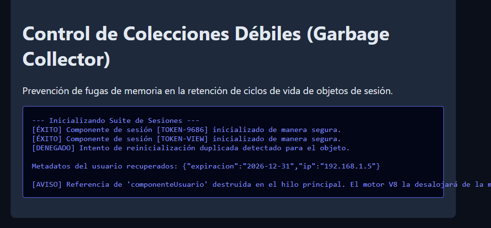

# Reto 66 - Dashboard con gráficos simples

## 🎯 Objetivo
Mostrar datos estadísticos usando canvas o SVG simples generados desde JavaScript.

## 🛠️ Requisitos
- Navegador web moderno (Chrome, Firefox, Edge).
- [Visual Studio Code](https://code.visualstudio.com/) y Live Server (recomendado).

## ▶️ Cómo ejecutar
### 🌐 Usando Live Server
1. Abre la carpeta en VS Code y lanza Live Server.
2. El dashboard se carga con gráficos de barras o circulares simples.

## 🧠 Decisiones y proceso de solución
- Usé la API Canvas para dibujar gráficos de barras.
- Los datos de ejemplo se definen en un objeto de configuración.
- Cada gráfico tiene su propio canvas y se dibuja al cargar la página.
- Añadí etiquetas y colores para hacer los gráficos legibles.

## ⚠️ Dificultades encontradas
- Calcular las proporciones de las barras respecto al canvas fue un desafío matemático.
- El texto en canvas no se redimensiona bien; tuve que calcular el tamaño de fuente.
- Para gráficos circulares, recordar las fórmulas de trigonometría fue necesario.

## ✅ Pruebas realizadas
- [x] El gráfico de barras se dibuja correctamente.
- [x] Los datos coinciden con las alturas de las barras.
- [x] Al cambiar los datos (ej. desde un select), el gráfico se actualiza.
- [x] No hay errores de consola relacionados con canvas.

## 📸 Evidencia
*Captura de pantalla del navegador después de ejecutar el reto.*

---

> **Nota:** Este reto forma parte del manual de JavaScript 2026. Desarrollado siguiendo los criterios de aceptación.
