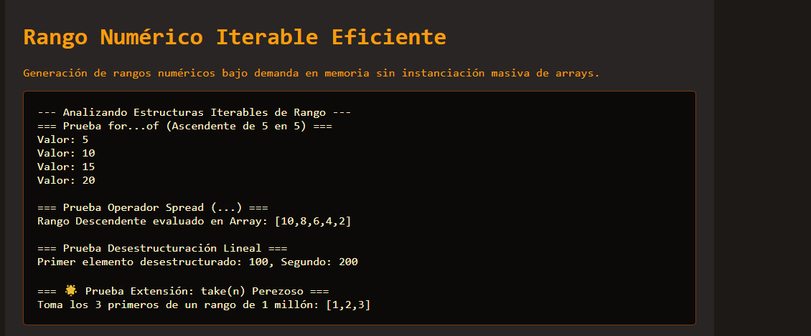

# Reto 67 - Reproductor de audio personalizado

## 🎯 Objetivo
Crear controles personalizados para un elemento de audio HTML5.

## 🛠️ Requisitos
- Navegador web moderno (Chrome, Firefox, Edge).
- [Visual Studio Code](https://code.visualstudio.com/) y Live Server (recomendado).

## ▶️ Cómo ejecutar
### 🌐 Usando Live Server
1. Abre la carpeta en VS Code y lanza Live Server.
2. Usa los botones personalizados para reproducir, pausar y controlar el volumen.

## 🧠 Decisiones y proceso de solución
- Oculté el reproductor nativo y creé botones personalizados.
- Usé la API de Audio para controlar play, pause, volumen y tiempo actual.
- Actualicé una barra de progreso y un temporizador en tiempo real.

## ⚠️ Dificultades encontradas
- El evento timeupdate se dispara muy seguido; tuve que optimizar la actualización.
- El control de volumen requirió un input range sincronizado.
- Asegurar que el audio no se solapara si el usuario hacía clic rápido en play fue importante.

## ✅ Pruebas realizadas
- [x] Los botones personalizados funcionan correctamente.
- [x] La barra de progreso avanza con la reproducción.
- [x] El control de volumen modifica el audio.
- [x] Al llegar al final, los controles vuelven al estado inicial.

## 📸 Evidencia
*Captura de pantalla del navegador después de ejecutar el reto.*

---

> **Nota:** Este reto forma parte del manual de JavaScript 2026. Desarrollado siguiendo los criterios de aceptación.
