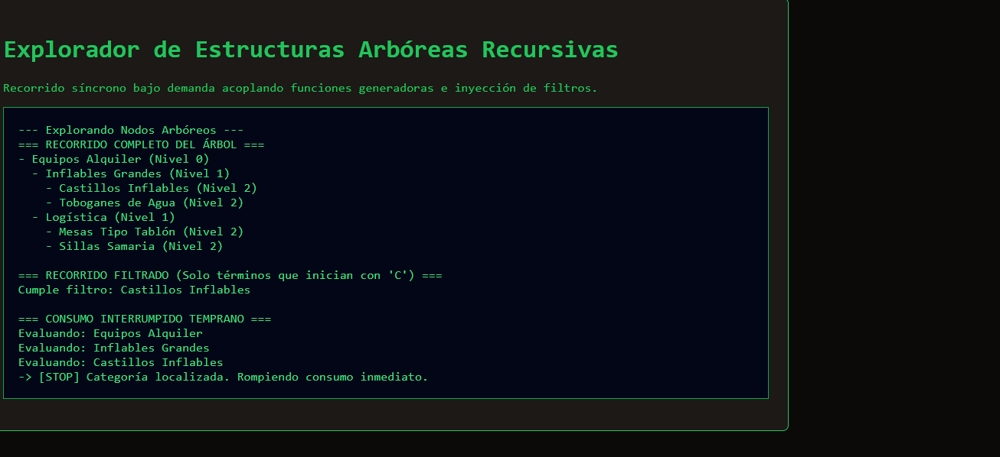

# Reto 68 - Galería de imágenes con lightbox

## 🎯 Objetivo
Crear una galería de imágenes que al hacer clic abra una vista ampliada (lightbox).

## 🛠️ Requisitos
- Navegador web moderno (Chrome, Firefox, Edge).
- [Visual Studio Code](https://code.visualstudio.com/) y Live Server (recomendado).

## ▶️ Cómo ejecutar
### 🌐 Usando Live Server
1. Abre la carpeta en VS Code y lanza Live Server.
2. Haz clic en una imagen para verla ampliada; cierra con la X o haciendo clic fuera.

## 🧠 Decisiones y proceso de solución
- Creé un overlay que se superpone a la página con la imagen ampliada.
- Al hacer clic en una miniatura, el overlay se muestra con la imagen correspondiente.
- Se puede cerrar con un botón X o haciendo clic fuera de la imagen.
- La navegación entre imágenes se hace con botones "anterior" y "siguiente".

## ⚠️ Dificultades encontradas
- El overlay debía cubrir toda la ventana, incluso si la página tiene scroll.
- El foco del teclado debía quedar atrapado dentro del lightbox por accesibilidad.
- Cargar imágenes grandes sin que se traben fue un reto; usé loading="lazy" en las miniaturas.

## ✅ Pruebas realizadas
- [x] Al hacer clic en una miniatura, se abre el lightbox.
- [x] La X y el clic fuera cierran el lightbox.
- [x] Los botones siguiente/anterior navegan entre imágenes.
- [x] La imagen ampliada se ajusta al tamaño de la ventana.

## 📸 Evidencia
*Captura de pantalla del navegador después de ejecutar el reto.*

---

> **Nota:** Este reto forma parte del manual de JavaScript 2026. Desarrollado siguiendo los criterios de aceptación.
