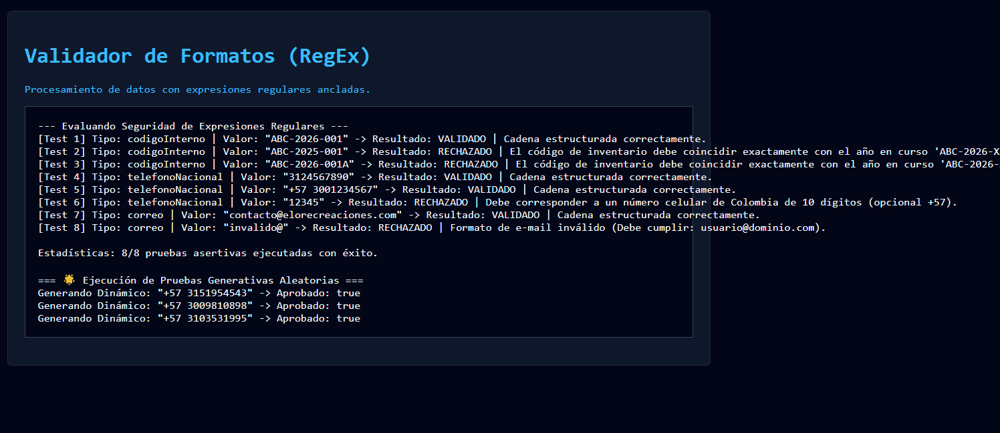

# Reto 69 - Calculadora de fechas con Intl

## 🎯 Objetivo
Calcular diferencias entre fechas, mostrar en formato localizado y manejar zonas horarias.

## 🛠️ Requisitos
- Navegador web moderno (Chrome, Firefox, Edge).
- [Visual Studio Code](https://code.visualstudio.com/) y Live Server (recomendado).

## ▶️ Cómo ejecutar
### 🌐 Usando Live Server
1. Abre la carpeta en VS Code y lanza Live Server.
2. Selecciona dos fechas y la calculadora mostrará la diferencia en días, meses y años.

## 🧠 Decisiones y proceso de solución
- Usé inputs de tipo date para la entrada de fechas.
- Calculé la diferencia en milisegundos y luego en días, meses y años.
- Formateé los resultados con Intl.DateTimeFormat para el locale es-CO.
- Manejé casos borde como años bisiestos y meses con diferente cantidad de días.

## ⚠️ Dificultades encontradas
- Calcular meses exactos entre dos fechas es más complejo que solo dividir milisegundos.
- Las fechas se almacenan en UTC; tuve que asegurarme de que la zona horaria local no afectara.
- Mostrar "hace 3 meses" o "dentro de 2 semanas" requirió lógica adicional.

## ✅ Pruebas realizadas
- [x] La diferencia en días es correcta para fechas cualquiera.
- [x] Las fechas se muestran en formato colombiano (dd/mm/aaaa).
- [x] Los años bisiestos se calculan correctamente.
- [x] Fechas iguales muestran "0 días".

## 📸 Evidencia
*Captura de pantalla del navegador después de ejecutar el reto.*

---

> **Nota:** Este reto forma parte del manual de JavaScript 2026. Desarrollado siguiendo los criterios de aceptación.
