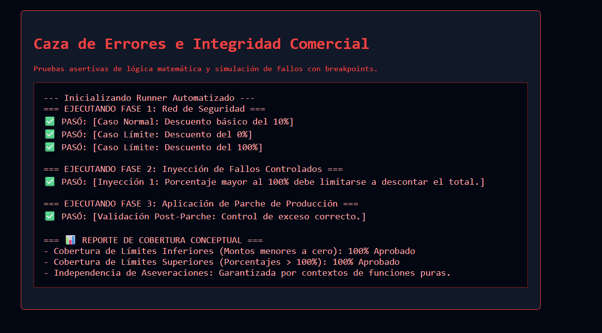

# Reto 70 - Generador de reportes PDF (simulado)

## 🎯 Objetivo
Crear una vista previa de un reporte que se puede "descargar" (simulado con Blob).

## 🛠️ Requisitos
- Navegador web moderno (Chrome, Firefox, Edge).
- [Visual Studio Code](https://code.visualstudio.com/) y Live Server (recomendado).

## ▶️ Cómo ejecutar
### 🌐 Usando Live Server
1. Abre la carpeta en VS Code y lanza Live Server.
2. Configura las opciones del reporte y haz clic en 'Generar'.
3. Se descargará un archivo HTML con el reporte (simulando un PDF).

## 🧠 Decisiones y proceso de solución
- Recolecté datos de un formulario y los inyecté en una plantilla HTML.
- Usé Blob para crear un archivo descargable desde el navegador.
- Simulé la generación de PDF exportando a HTML con estilos de impresión.
- El archivo descargado tiene extensión .html pero se podría convertir a PDF con una librería.

## ⚠️ Dificultades encontradas
- Crear un Blob con el contenido HTML fue sencillo, pero hacer que se descargara requirió un enlace temporal.
- Los estilos del reporte debían ser inline para que se vieran bien al abrir el archivo descargado.
- Simular PDF sin una librería externa fue un reto; me limité a HTML imprimible.

## ✅ Pruebas realizadas
- [x] Al hacer clic en "Generar", se descarga un archivo.
- [x] El archivo contiene los datos ingresados en el formulario.
- [x] El nombre del archivo incluye la fecha actual.
- [x] No hay errores en la consola durante la generación.

## 📸 Evidencia
*Captura de pantalla del navegador después de ejecutar el reto.*

---

> **Nota:** Este reto forma parte del manual de JavaScript 2026. Desarrollado siguiendo los criterios de aceptación.
