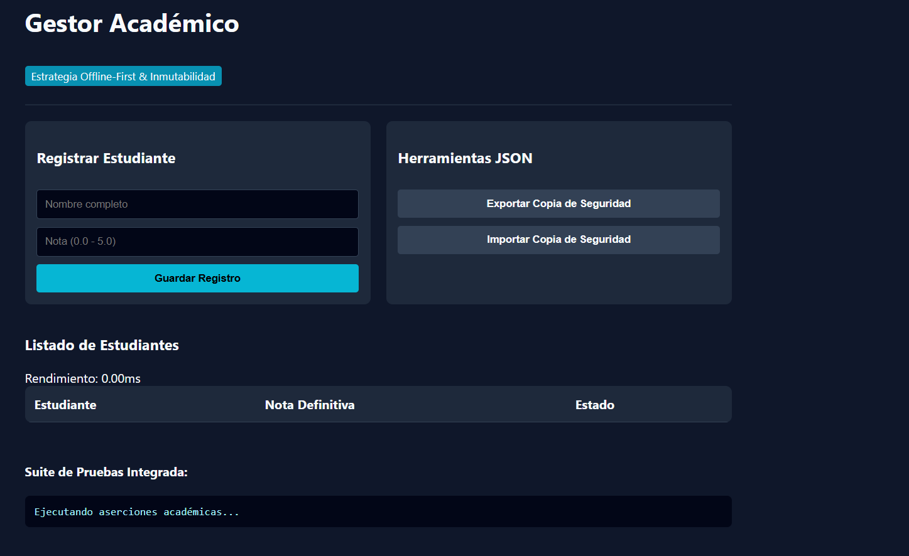

# Reto 71 - Sistema de pestañas (tabs) accesibles

## 🎯 Objetivo
Crear un componente de pestañas con navegación por teclado y atributos ARIA.

## 🛠️ Requisitos
- Navegador web moderno (Chrome, Firefox, Edge).
- [Visual Studio Code](https://code.visualstudio.com/) y Live Server (recomendado).

## ▶️ Cómo ejecutar
### 🌐 Usando Live Server
1. Abre la carpeta en VS Code y lanza Live Server.
2. Usa las pestañas con el ratón o con las teclas Tab y flechas.

## 🧠 Decisiones y proceso de solución
- Implementé roles ARIA (tablist, tab, tabpanel) para accesibilidad.
- Cada pestaña tiene un tabindex que cambia según cuál esté activa.
- Las teclas izquierda/derecha mueven el foco entre pestañas; Enter o Space activan una.
- El contenido se muestra/oculta con CSS, no con display none (para lectores de pantalla).

## ⚠️ Dificultades encontradas
- Aprender los roles ARIA correctos tomó tiempo de investigación.
- El manejo del foco y tabindex fue lo más complicado.
- Asegurar que solo el panel activo sea visible para todos los usuarios (incluyendo tecnologías de asistencia).

## ✅ Pruebas realizadas
- [x] Las pestañas se activan con clic y con teclado.
- [x] El foco se mueve correctamente con las flechas.
- [x] El panel correspondiente se muestra al activar una pestaña.
- [x] Los atributos ARIA están presentes y son correctos.

## 📸 Evidencia
*Captura de pantalla del navegador después de ejecutar el reto.*

---

> **Nota:** Este reto forma parte del manual de JavaScript 2026. Desarrollado siguiendo los criterios de aceptación.
