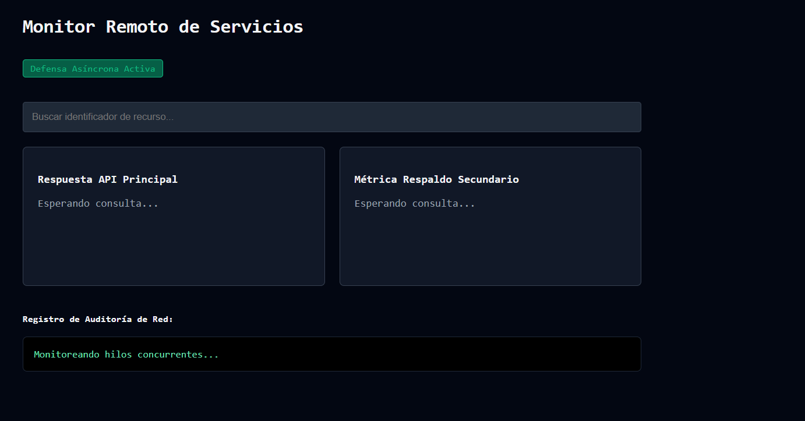

# Reto 72 - Proyecto final: Dashboard modular

## 🎯 Objetivo
Integrar varios componentes (gráficos, listas, formularios) en un dashboard unificado usando módulos ES.

## 🛠️ Requisitos
- Navegador web moderno (Chrome, Firefox, Edge).
- [Visual Studio Code](https://code.visualstudio.com/) y Live Server (recomendado).

## ▶️ Cómo ejecutar
### 🌐 Usando Live Server
1. Abre la carpeta en VS Code y lanza Live Server.
2. El dashboard carga varios componentes simultáneamente.
3. Interactúa con cada sección: gráficos, lista de tareas, formulario de configuración.

## 🧠 Decisiones y proceso de solución
- Estructuré el proyecto en módulos ES: datos, servicios, componentes y app principal.
- Cada componente se renderiza en su propio contenedor.
- Usé Promise.all para cargar datos iniciales en paralelo.
- Implementé un sistema de eventos simple para comunicar componentes.

## ⚠️ Dificultades encontradas
- Coordinar tantos módulos fue un reto de organización.
- Asegurar que los componentes no se pisaran el DOM entre sí.
- La comunicación entre componentes sin un framework fue compleja; usé un patrón pub/sub simple.

## ✅ Pruebas realizadas
- [x] Todos los componentes se renderizan sin errores.
- [x] Las interacciones en un componente no rompen otros.
- [x] Los datos se cargan en paralelo correctamente.
- [x] El dashboard se ve bien en diferentes tamaños de pantalla (responsive básico).

## 📸 Evidencia
*Captura de pantalla del navegador después de ejecutar el reto.*

---

> **Nota:** Este reto forma parte del manual de JavaScript 2026. Desarrollado siguiendo los criterios de aceptación.
