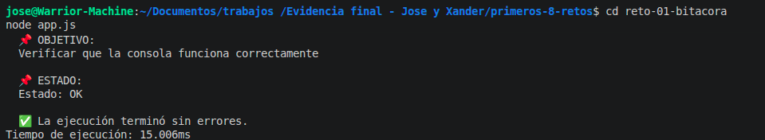

# Reto 1 – Bitácora del primer programa

## 🛠️ Requisitos
- Tener **Node.js** instalado (versión LTS recomendada).
- Terminal o línea de comandos.

## ▶️ Cómo ejecutar

### Windows (CMD o PowerShell)
```bash
cd reto-01-bitacora
node app.js
```

### Linux / macOS (Bash)
```bash
cd reto-01-bitacora
node app.js
```

## 🎯 Objetivo
Confirmar que el entorno de JavaScript funciona y construir una salida legible usando `console.log`, comentarios y secuencias de escape.

## 🧠 Proceso y decisiones

- Primero escribí un comentario de cabecera con mis datos, como buena práctica.
- Decidí usar `console.group` para organizar la salida en un bloque, simulando un reporte.
- Usé `\t` y `\n` dentro de una cadena para practicar secuencias de escape sin repetir `console.log`.
- Agregué `console.time` y `console.timeEnd` para medir el tiempo de ejecución (extensión).
- Separé los mensajes de inicio, objetivo y estado en variables `const` porque no cambiarían.

## ⚠️ Dificultades encontradas

- Al principio olvidé cerrar el grupo con `console.groupEnd` y la salida se veía anidada. Lo noté cuando ejecuté dos veces el código.
- La extensión de medir tiempo me confundió; no sabía que el identificador debía ser el mismo. Leí la documentación y lo corregí.

## ✅ Pruebas realizadas
- [x] El archivo se ejecuta sin errores en Node.js.
- [x] La consola muestra título, datos y cierre agrupados.
- [x] Se evidencia tabulación y salto de línea.
- [x] El tiempo de ejecución se muestra al final.

## 📸 Evidencia
*Captura de la terminal ejecutando el código:*


## 🔧 Mejoras pendientes
- Probar con otros estilos de salida como `console.table` para los datos.
