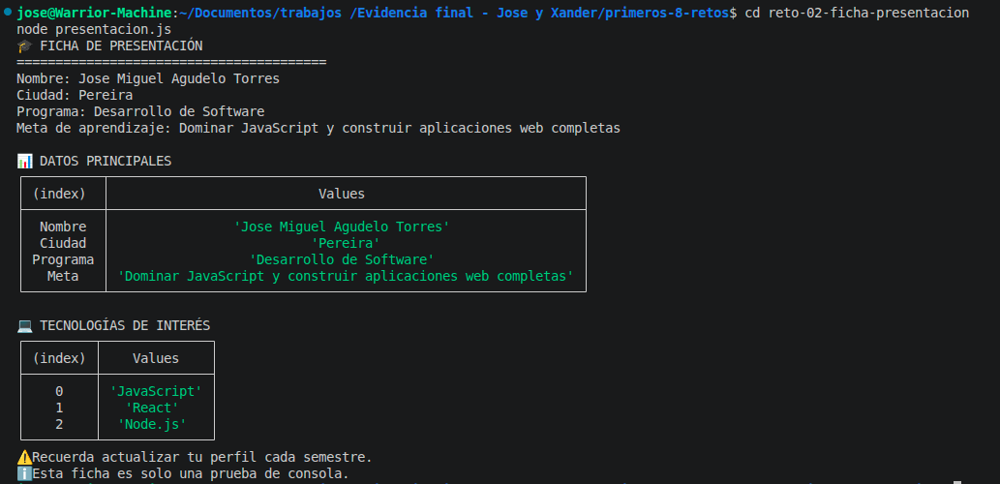

# Reto 2 – Ficha digital de presentación

## 🛠️ Requisitos
- Tener **Node.js** instalado (versión LTS recomendada).
- Terminal o línea de comandos.

## ▶️ Cómo ejecutar

### Windows (CMD o PowerShell)
```bash
cd reto-02-ficha-presentacion
node presentacion.js
```

### Linux / macOS (Bash)
```bash
cd reto-02-ficha-presentacion
node presentacion.js
```

## 🎯 Objetivo
Generar una ficha personal con datos académicos usando diferentes métodos de consola (`log`, `info`, `warn`, `table`) y documentar sus diferencias.

## 🧠 Proceso y decisiones

- Definí mis datos personales en constantes porque no cambiarán durante la ejecución.
- Construí un arreglo de tecnologías para mostrarlo en tabla.
- Usé `console.table` tanto con un objeto (datos principales) como con un array (tecnologías) para ver su comportamiento.
- Incluí `console.warn` e `console.info` para diferenciarlos de `console.log` y anoté lo que observé en comentarios.

## ⚠️ Dificultades encontradas

- Al principio puse la tabla de tecnologías dentro de un `console.log` y no se veía bien; luego entendí que `console.table` recibe directamente el array.
- Investigar las diferencias entre métodos tomó más tiempo del esperado, pero me sirvió para entender que `warn` e `info` tienen estilos distintos en el navegador.

## ✅ Pruebas realizadas
- [x] La ficha contiene los cuatro datos solicitados.
- [x] La tabla muestra correctamente las tecnologías.
- [x] Se usaron al menos cuatro métodos de consola.
- [x] El código está comentado y ordenado.

## 📸 Evidencia
*Captura de la terminal ejecutando el código:*


## 🔧 Mejoras pendientes
- Implementar la extensión de estilo CSS con `%c` para darle color a la consola.
