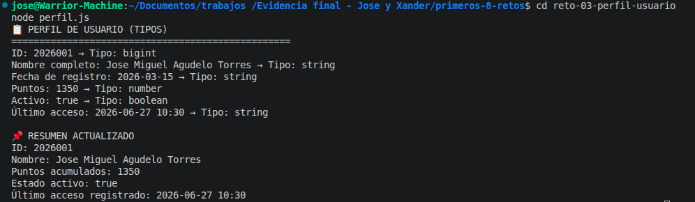

# Reto 3 – Perfil de usuario tipado

## 🛠️ Requisitos
- Tener **Node.js** instalado (versión LTS recomendada).
- Terminal o línea de comandos.

## ▶️ Cómo ejecutar

### Windows (CMD o PowerShell)
```bash
cd reto-03-perfil-usuario
node perfil.js
```

### Linux / macOS (Bash)
```bash
cd reto-03-perfil-usuario
node perfil.js
```

## 🎯 Objetivo
Distinguir `let` y `const`, reconocer tipos primitivos y comprobarlos con `typeof`.

## 🧠 Proceso y decisiones

- Declaré con `const` los datos que nunca cambian: ID (bigint), nombre completo y fecha de registro.
- Usé `let` para puntos, estado activo y último acceso porque sí se actualizan.
- Simulé una nueva sesión incrementando puntos y asignando fecha de acceso.
- Mostré cada valor junto a su `typeof` y luego un resumen final.

## ⚠️ Dificultades encontradas

- El tipo bigint me costó entenderlo; tuve que poner una `n` al final del número para que no diera error.
- Al inicio declaré `ultimoAcceso` sin valor, y `typeof` devolvió `undefined`. Quería que saliera como string después de asignarlo, pero recordé que `typeof` es dinámico.

## ✅ Pruebas realizadas
- [x] Las constantes no se reasignan.
- [x] Las variables mutables cambian correctamente.
- [x] `typeof` se aplica a todos los datos.
- [x] El resumen refleja el estado final.

## 📸 Evidencia
*Captura de la terminal ejecutando el código:*


## 🔧 Mejoras pendientes
- Añadir un Symbol para representar una clave interna y explicar por qué es único.
