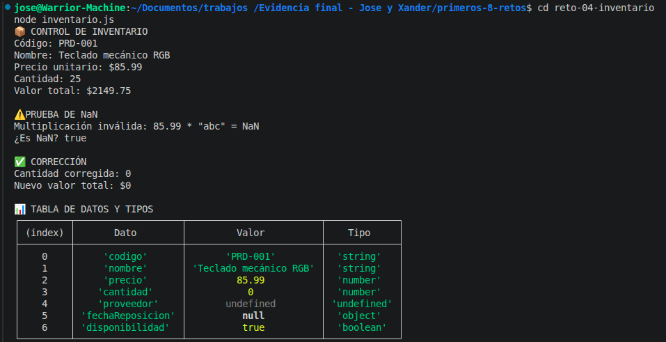

# Reto 4 – Control de inventario básico

## 🛠️ Requisitos
- Tener **Node.js** instalado (versión LTS recomendada).
- Terminal o línea de comandos.

## ▶️ Cómo ejecutar

### Windows (CMD o PowerShell)
```bash
cd reto-04-inventario
node inventario.js
```

### Linux / macOS (Bash)
```bash
cd reto-04-inventario
node inventario.js
```

## 🎯 Objetivo
Modelar datos con variables y reconocer `null`, `undefined`, `NaN` y conversiones simples.

## 🧠 Proceso y decisiones

- Declaré los datos del producto con nombres descriptivos.
- Dejé `proveedor` sin definir (undefined) y `fechaReposicion` como null para distinguirlos.
- Calculé el valor total multiplicando precio por cantidad.
- Provocó un NaN a propósito multiplicando precio por un string no numérico, luego lo detecté con `Number.isNaN` y lo corregí asignando 0.
- Creé una tabla con dato, valor y tipo.

## ⚠️ Dificultades encontradas

- Entender la diferencia real entre null y undefined me tomó un par de lecturas. Ahora sé que undefined lo da JavaScript cuando no hay valor, y null lo pone el programador intencionalmente.
- Al principio usé `isNaN` global, pero luego recordé que `Number.isNaN` es más estricto.

## ✅ Pruebas realizadas
- [x] El total válido es numérico.
- [x] NaN se detecta correctamente.
- [x] La tabla evidencia los tipos.
- [x] La corrección produce un nuevo resultado coherente.

## 📸 Evidencia
*Captura de la terminal ejecutando el código:*


## 🔧 Mejoras pendientes
- Agregar validación para impedir cantidades negativas.
