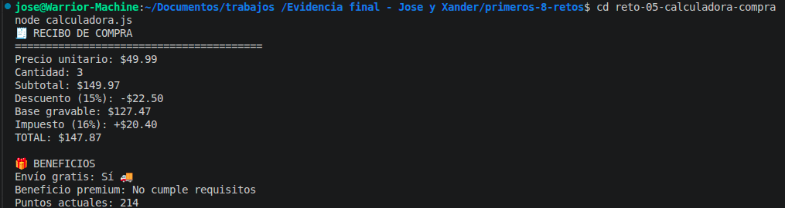

# Reto 5 – Calculadora de compra inteligente

## 🛠️ Requisitos
- Tener **Node.js** instalado (versión LTS recomendada).
- Terminal o línea de comandos.

## ▶️ Cómo ejecutar

### Windows (CMD o PowerShell)
```bash
cd reto-05-calculadora-compra
node calculadora.js
```

### Linux / macOS (Bash)
```bash
cd reto-05-calculadora-compra
node calculadora.js
```

## 🎯 Objetivo
Aplicar operadores aritméticos, de asignación, comparación y lógicos en un cálculo completo.

## 🧠 Proceso y decisiones

- Definí variables para precio, cantidad, descuento e impuesto.
- Calculé subtotal, descuento, base gravable, impuesto y total paso a paso, guardando cada resultado en variables descriptivas.
- Usé un operador de asignación compuesto (`+=`) para actualizar los puntos del cliente.
- Combiné dos condiciones con `&&` para el beneficio premium y una comparación para envío gratis.
- Formateé el recibo con `.toFixed(2)` para dos decimales.

## ⚠️ Dificultades encontradas

- Al principio puse mal los paréntesis en el cálculo del descuento y me dio un número negativo; lo arreglé revisando la fórmula.
- La condición de beneficio premium la planteé primero con `||` y luego me di cuenta de que debían cumplirse ambas, así que usé `&&`.

## ✅ Pruebas realizadas
- [x] Todos los cálculos se derivan de variables.
- [x] El beneficio premium depende de dos condiciones.
- [x] El recibo es legible.
- [x] Los resultados decimales están formateados.

## 📸 Evidencia
*Captura de la terminal ejecutando el código:*


## 🔧 Mejoras pendientes
- Permitir cambio de moneda y agregar comisión opcional con el operador nullish coalescing.
