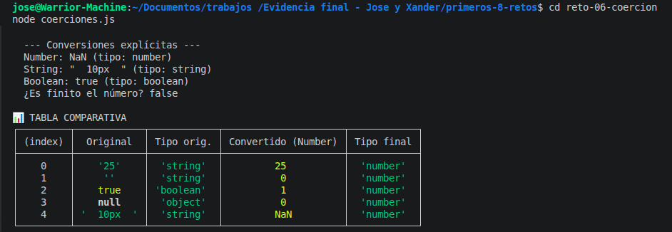

# Reto 6 – Laboratorio de coerción segura

## 🛠️ Requisitos
- Tener **Node.js** instalado (versión LTS recomendada).
- Terminal o línea de comandos.

## ▶️ Cómo ejecutar

### Windows (CMD o PowerShell)
```bash
cd reto-06-coercion
node coerciones.js
```

### Linux / macOS (Bash)
```bash
cd reto-06-coercion
node coerciones.js
```

## 🎯 Objetivo
Comparar coerción implícita y conversión explícita para evitar resultados inesperados.

## 🧠 Proceso y decisiones

- Creé un arreglo de entradas simuladas con diferentes tipos problemáticos.
- Probé sumas y comparaciones sin convertir (coerción implícita) y registré los resultados extraños.
- Luego convertí explícitamente con `Number`, `String` y `Boolean`.
- Validé con `Number.isFinite` cuáles conversiones eran utilizables.
- Comparé `==` con `===` en tres casos y documenté los resultados en comentarios.
- Generé una tabla comparativa final.

## ⚠️ Dificultades encontradas

- La cadena vacía me dio problemas: `Number("")` devuelve 0, pero `Number(" ")` también. Eso fue confuso.
- Entender por qué `null == undefined` es true pero `null === undefined` es false me ayudó a valorar el operador estricto.

## ✅ Pruebas realizadas
- [x] La tabla muestra al menos cinco casos.
- [x] Se evidencia la diferencia entre == y ===.
- [x] Las conversiones inválidas son identificadas.
- [x] El código no depende de coerción accidental.

## 📸 Evidencia
*Captura de la terminal ejecutando el código:*


## 🔧 Mejoras pendientes
- Incluir parseInt y parseFloat y comparar sus resultados con Number.
