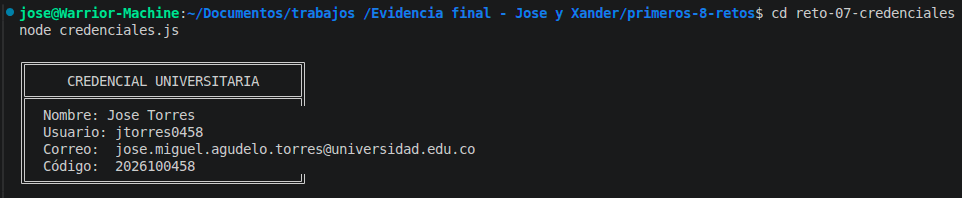

# Reto 7 – Generador de credenciales

## 🛠️ Requisitos
- Tener **Node.js** instalado (versión LTS recomendada).
- Terminal o línea de comandos.

## ▶️ Cómo ejecutar

### Windows (CMD o PowerShell)
```bash
cd reto-07-credenciales
node credenciales.js
```

### Linux / macOS (Bash)
```bash
cd reto-07-credenciales
node credenciales.js
```

## 🎯 Objetivo
Usar métodos de string y template literals para producir identificadores consistentes.

## 🧠 Proceso y decisiones

- Partí de un nombre con espacios sobrantes y mayúsculas/minúsculas mezcladas.
- Limpié el texto con `trim()` y normalicé espacios con una expresión regular.
- Separé el nombre en partes con `split`, extraje primer nombre y primer apellido, y los capitalicé con `charAt(0).toUpperCase()`.
- Generé el correo institucional en minúsculas, quitando tildes con `normalize`.
- Construí el usuario con inicial, apellido y últimos 4 dígitos del código.
- Mostré la credencial dentro de un template literal multilínea.

## ⚠️ Dificultades encontradas

- La expresión regular para quitar tildes (`normalize("NFD")`) no la conocía; tuve que investigar.
- Al principio el correo me quedaba con espacios; usé `replace` para cambiarlos por puntos.
- Me costó decidir qué método usar para capitalizar: `toUpperCase` solo en la primera letra combinado con `slice(1)` fue la solución.

## ✅ Pruebas realizadas
- [x] El nombre queda normalizado.
- [x] Usuario y correo se derivan de los datos.
- [x] La plantilla contiene varias líneas.
- [x] La solución funciona con otro nombre similar.

## 📸 Evidencia
*Captura de la terminal ejecutando el código:*


## 🔧 Mejoras pendientes
- Eliminar tildes con normalize y una expresión regular más robusta (ya incluido, pero se puede mejorar).
