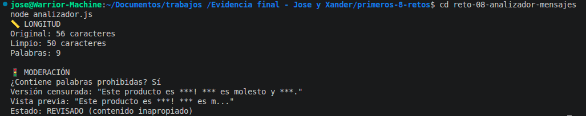

# Reto 8 – Analizador de mensajes

## 🛠️ Requisitos
- Tener **Node.js** instalado (versión LTS recomendada).
- Terminal o línea de comandos.

## ▶️ Cómo ejecutar

### Windows (CMD o PowerShell)
```bash
cd reto-08-analizador-mensajes
node analizador.js
```

### Linux / macOS (Bash)
```bash
cd reto-08-analizador-mensajes
node analizador.js
```

## 🎯 Objetivo
Aplicar búsqueda, reemplazo, conteo y segmentación de cadenas.

## 🧠 Proceso y decisiones

- Definí un mensaje de prueba con espacios dobles y palabras repetidas.
- Limpié espacios con `trim()` y una expresión regular.
- Calculé longitudes y conté palabras con `split(" ")`.
- Busqué palabras prohibidas sin importar mayúsculas usando expresiones regulares con la bandera `gi`.
- Reemplacé cada palabra prohibida por asteriscos en una nueva variable.
- Generé un resumen con las primeras 30 letras, estado de moderación y versión censurada.

## ⚠️ Dificultades encontradas

- La bandera `gi` en la expresión regular fue nueva para mí; sin la `i` no detectaba "SPAM" en mayúsculas.
- Al contar palabras, al principio no limpié bien los espacios dobles y me contaba palabras vacías. Luego lo corregí con `replace(/\s+/g, " ")`.
- La vista previa de 30 caracteres a veces cortaba palabras; decidí usar `substring` simple porque el reto no pedía cortar por palabra completa.

## ✅ Pruebas realizadas
- [x] Se conservan original y versión procesada.
- [x] Las palabras prohibidas se ocultan.
- [x] El conteo de palabras es razonable.
- [x] La vista previa no excede 30 caracteres.

## 📸 Evidencia
*Captura de la terminal ejecutando el código:*


## 🔧 Mejoras pendientes
- Añadir contador de vocales y consonantes (extensión).
