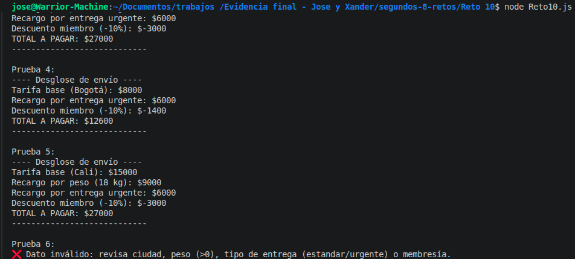

# Reto 10 - Cotizador de envíos

## 🎯 Objetivo
Calcular el costo de envío según ciudad, peso, tipo de entrega y membresía.

## 🛠️ Requisitos
- Tener [Node.js](https://nodejs.org) instalado (versión LTS recomendada).
- Terminal o línea de comandos (Git Bash, CMD, PowerShell, Bash).

## ▶️ Cómo ejecutar
Abre una terminal en la raíz del repositorio.
Ejecuta:
```bash
cd segundos-8-retos/Reto\ 10
node Reto10.js
```
Verás el desglose y total de seis escenarios diferentes.

## 🧠 Decisiones y proceso de solución

- Separé el cálculo de la presentación: la función `calcularCotizacion` retorna un objeto con validez, desglose y total; `mostrarCotizacion` solo imprime.
- Inicié una variable `total` con la tarifa base y fui acumulando recargos (peso, urgencia) y descuentos (miembro, finde).
- Usé condicionales anidados para el peso porque los límites son acumulativos (5 y 15 kg).
- Implementé la extensión de promoción de fin de semana detectando el día con `getDay()`.
- El descuento de miembro solo se aplica si el total hasta ese momento supera los 10 000, respetando la condición mínima.
- Validé que el peso sea positivo y que el tipo de entrega sea válido antes de calcular.

## ⚠️ Dificultades encontradas

- Al principio puse los recargos como `if-else`, pero así si un paquete pesaba más de 15 solo pagaba el recargo alto y no el medio. El enunciado decía "recargos deben acumularse", así que los puse en `if` separados.
- La fecha de fin de semana la probé con un sábado, pero dudé si debía usar `getDay()` que empieza en domingo. Confirmé en internet y lo dejé así.

## ✅ Pruebas realizadas

- [x] Envío a Bogotá, 3 kg estándar → tarifa base 8000
- [x] Envío a Medellín, 10 kg estándar → externa + recargo peso medio
- [x] Envío a Medellín, 20 kg urgente miembro → todos los recargos y descuento
- [x] Bogotá, 2 kg urgente miembro → no aplica descuento (total < 10000)
- [x] Cali, 18 kg urgente miembro en sábado → incluye promo fin de semana
- [x] Peso negativo → dato inválido

## 📸 Evidencia
*Reemplaza esta línea con la captura de pantalla de la terminal después de ejecutar el código.*
Salida del desglose de cada prueba.



---

> **Nota del autor (Xander):** Este reto me ayudó a practicar estructuras de control, funciones y trabajo en equipo. Si algo puede mejorar, ¡bienvenidas las sugerencias!
