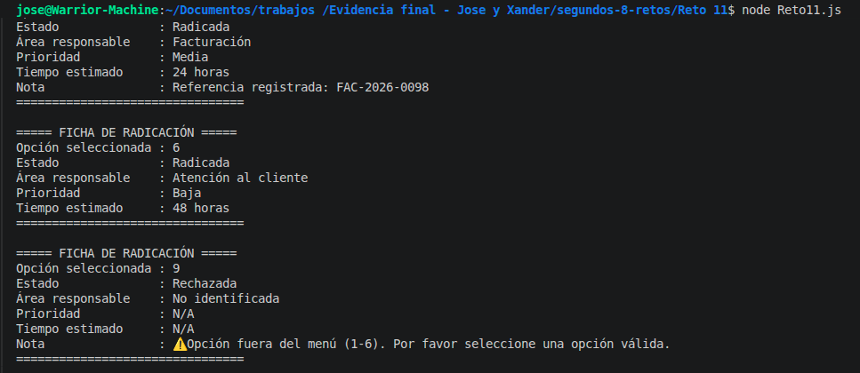

# Reto 11 - Menú de soporte técnico

## 🎯 Objetivo
Clasificar solicitudes por opción numérica usando switch, agrupando casos y con validación adicional.

## 🛠️ Requisitos
- Tener [Node.js](https://nodejs.org) instalado (versión LTS recomendada).
- Terminal o línea de comandos (Git Bash, CMD, PowerShell, Bash).

## ▶️ Cómo ejecutar
Abre una terminal en la raíz del repositorio.
Ejecuta:
```bash
cd segundos-8-retos/Reto\ 11
node Reto11.js
```
Verás la ficha de radicación para cada opción.

## 🧠 Decisiones y proceso de solución

- Envolví el switch en una función `clasificarSolicitud` para que sea reutilizable (extensión).
- Agrupé los casos 3 y 4 (problemas de red y credenciales) porque los atiende el mismo equipo, usando fall-through.
- Dentro del caso agrupado, usé un operador ternario para matizar la prioridad (4 es más crítica que 3).
- El caso 5 (facturación) requiere validación adicional: si no se recibe un dato extra, se marca como "No asignado" y se pide el número de factura.
- El default informa claramente que la opción no es válida.
- La ficha incluye área, prioridad, tiempo estimado y estado.

## ⚠️ Dificultades encontradas

- Al probar el caso 5 con dato vacío, me saltó error porque `datoAdicional.trim()` fallaba si era null. Lo resolví validando primero si era null o cadena vacía.
- Me confundí con el parámetro: en las pruebas lo llamé `dato` pero en la función `datoAdicional`. José me lo señaló; luego lo unifiqué para que funcionara correctamente.
- El fall-through de los casos 3 y 4 al principio me pareció peligroso, pero recordé que en el manual se recomendaba agruparlos para no repetir código.

## ✅ Pruebas realizadas

- [x] Opción 1: Hardware, Alta, 4h
- [x] Opción 2: Software, Media, 8h
- [x] Opción 3: Infraestructura, Media, 6h
- [x] Opción 4: Infraestructura, Alta, 6h
- [x] Opción 5 sin dato: Facturación, Media, No asignado, pide referencia
- [x] Opción 5 con dato: Facturación, Media, 24h
- [x] Opción 6: Atención al cliente, Baja, 48h
- [x] Opción 9: Rechazada, N/A

## 📸 Evidencia
*Reemplaza esta línea con la captura de pantalla de la terminal después de ejecutar el código.*
Fichas de radicación impresas para las 8 pruebas.



---

> **Nota del autor (Xander):** Este reto me ayudó a practicar estructuras de control, funciones y trabajo en equipo. Si algo puede mejorar, ¡bienvenidas las sugerencias!
