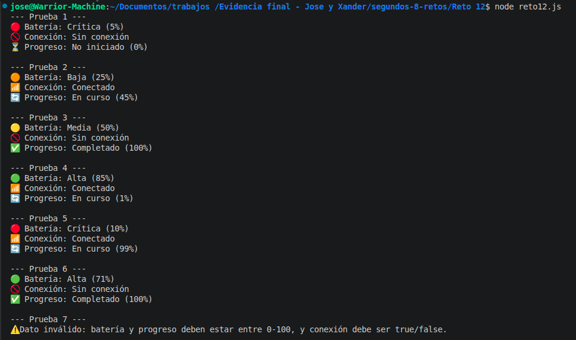

# Reto 12 - Panel de estados con ternarios

## 🎯 Objetivo
Generar etiquetas de batería, conexión y progreso usando operadores ternarios simples y anidados con límites claros.

## 🛠️ Requisitos
- Tener [Node.js](https://nodejs.org) instalado (versión LTS recomendada).
- Terminal o línea de comandos (Git Bash, CMD, PowerShell, Bash).

## ▶️ Cómo ejecutar
Abre una terminal en la raíz del repositorio.
Ejecuta:
```bash
cd segundos-8-retos/Reto\ 12
node Reto12.js
```
Verás la tarjeta de estado para siete combinaciones.

## 🧠 Decisiones y proceso de solución

- Documenté los límites exactos: batería crítica 0-10, baja 11-30, media 31-70, alta 71-100; progreso 0% = No iniciado, 100% = Completado, resto En curso.
- Para la batería usé un ternario anidado, pero lo separé en variables intermedias (`noEsCritica`, `esAlta`, `esMedia`) para no superar dos niveles y que sea legible.
- La conexión es un ternario simple (dos resultados).
- El progreso también lo refactoricé con variables booleanas para evitar anidar comparaciones de igualdad en un solo ternario.
- Agregué iconos textuales como extensión para que la tarjeta sea más visual.
- La función `generarTarjetaEstado` retorna la cadena formateada, no imprime directamente.

## ⚠️ Dificultades encontradas

- Al principio quise hacer un ternario de tres niveles para batería, pero se volvía ilegible. Apliqué la pista: "si necesitas explicar un ternario durante mucho tiempo, mejor usa if". Preferí las variables intermedias.
- El límite exacto de Crítica (0-10) me costó; al poner `porcentajeBateria <= 10` olvidé que 0 es válido y 10 también, pero tuve que ajustar la lógica para que 0 no diera error en el ternario.
- Me aseguré de que la conexión solo fuera true/false y no recibiera otros valores.

## ✅ Pruebas realizadas

- [x] Batería 5%: Crítica
- [x] Batería 25%: Baja
- [x] Batería 50%: Media
- [x] Batería 85%: Alta
- [x] Progreso 0: No iniciado; 100: Completado; intermedio: En curso
- [x] Dato inválido (batería 150) → mensaje de error

## 📸 Evidencia
*Reemplaza esta línea con la captura de pantalla de la terminal después de ejecutar el código.*
Tarjetas de estado impresas para cada prueba.



---

> **Nota del autor (Xander):** Este reto me ayudó a practicar estructuras de control, funciones y trabajo en equipo. Si algo puede mejorar, ¡bienvenidas las sugerencias!
