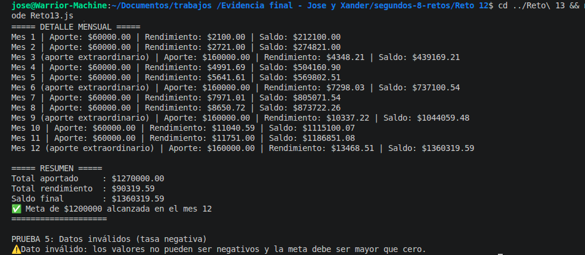

# Reto 13 - Planificador de ahorro

## 🎯 Objetivo
Simular el ahorro mensual durante un año con aportes, rendimiento y detección de meta.

## 🛠️ Requisitos
- Tener [Node.js](https://nodejs.org) instalado (versión LTS recomendada).
- Terminal o línea de comandos (Git Bash, CMD, PowerShell, Bash).

## ▶️ Cómo ejecutar
Abre una terminal en la raíz del repositorio.
Ejecuta:
```bash
cd segundos-8-retos/Reto\ 13
node Reto13.js
```
Verás el detalle mensual y el resumen de varias simulaciones.

## 🧠 Decisiones y proceso de solución

- Usé un bucle for para los 12 meses porque el número de iteraciones es conocido.
- Separé el total aportado y el rendimiento generado en variables diferentes para el resumen.
- No redondeé durante los cálculos, solo al mostrar con `toFixed(2)`.
- Detecté el primer mes donde el saldo alcanza la meta con una variable `mesMetaAlcanzada` que se actualiza solo una vez.
- Añadí la extensión de aporte extraordinario cada tercer mes (múltiplo de 3) con un condicional dentro del ciclo.
- Validé que los datos iniciales no sean negativos.

## ⚠️ Dificultades encontradas

- Tuve que recordar que el rendimiento se aplica después de sumar el aporte del mes, no antes. Probé varias fórmulas hasta que cuadró.
- Al implementar la detección de meta, casi la pongo dentro del bucle con un if que se ejecutaba cada mes; luego entendí que debía guardar el primer mes nada más.
- El aporte extraordinario me enredó un poco: al ser cada tercer mes, usé `mes % 3 === 0`, pero tuve que verificar que el mes 0 no existe (el bucle empieza en 1).

## ✅ Pruebas realizadas

- [x] Simulación con meta inalcanzable en 12 meses → mensaje "no alcanzada"
- [x] Simulación con meta alcanzable a mitad de año
- [x] Simulación sin ahorro inicial, solo aporte mensual
- [x] Simulación con aporte extra cada tercer mes
- [x] Datos inválidos (tasa negativa) → error

## 📸 Evidencia
*Reemplaza esta línea con la captura de pantalla de la terminal después de ejecutar el código.*
Detalle mensual y resumen de cada prueba.



---

> **Nota del autor (Xander):** Este reto me ayudó a practicar estructuras de control, funciones y trabajo en equipo. Si algo puede mejorar, ¡bienvenidas las sugerencias!
