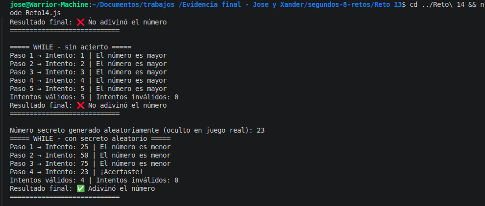

# Reto 14 - Juego de intentos controlados

## 🎯 Objetivo
Simular intentos de adivinanza con while y do...while, usando break y continue.

## 🛠️ Requisitos
- Tener [Node.js](https://nodejs.org) instalado (versión LTS recomendada).
- Terminal o línea de comandos (Git Bash, CMD, PowerShell, Bash).

## ▶️ Cómo ejecutar
Abre una terminal en la raíz del repositorio.
Ejecuta:
```bash
cd segundos-8-retos/Reto\ 14
node Reto14.js
```
Verás el historial de intentos y la comparación entre while y do...while.

## 🧠 Decisiones y proceso de solución

- Creé dos funciones: una con while y otra con do...while, para comparar su comportamiento.
- En ambas versiones, el ciclo controla el índice del arreglo de intentos y el máximo de intentos válidos.
- Uso `continue` para saltar intentos no numéricos o fuera del rango 0-100, sin descontar intentos válidos.
- `break` se activa al encontrar el número secreto, evitando procesar los intentos restantes.
- Conté por separado intentos válidos e inválidos.
- Implementé la extensión: generación de número secreto aleatorio con `Math.random` y validación de rango.
- El do...while está protegido contra arreglo vacío, devolviendo un resultado especial.

## ⚠️ Dificultades encontradas

- Al principio olvidé incrementar el índice en el while, y se volvió un ciclo infinito. Menos mal que tenía un máximo de intentos para salir.
- El do...while me obligó a pensar qué pasa si el arreglo está vacío, porque el primer intento siempre se evalúa. Añadí un if al inicio para manejarlo.
- La diferencia entre while y do...while la anoté en comentarios: while verifica la condición antes de ejecutar el cuerpo, do...while la verifica después. En este caso, ambos funcionan similar porque el índice se actualiza al inicio del bloque.
- La extensión de número aleatorio fue fácil, pero tuve que validar que estuviera dentro del rango.

## ✅ Pruebas realizadas

- [x] While y do...while con intentos que incluyen un inválido y acierto.
- [x] do...while con arreglo vacío → manejo especial.
- [x] While sin acierto → agota intentos válidos.
- [x] Prueba con secreto aleatorio.

## 📸 Evidencia
*Reemplaza esta línea con la captura de pantalla de la terminal después de ejecutar el código.*
Resultados de cada estrategia mostrando el historial.



---

> **Nota del autor (Xander):** Este reto me ayudó a practicar estructuras de control, funciones y trabajo en equipo. Si algo puede mejorar, ¡bienvenidas las sugerencias!
