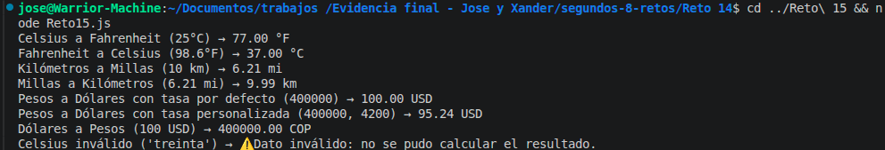

# Reto 15 - Biblioteca de conversiones

## 🎯 Objetivo
Crear funciones puras para convertir Celsius, kilómetros y pesos, con validación y formateo separado.

## 🛠️ Requisitos
- Tener [Node.js](https://nodejs.org) instalado (versión LTS recomendada).
- Terminal o línea de comandos (Git Bash, CMD, PowerShell, Bash).

## ▶️ Cómo ejecutar
Abre una terminal en la raíz del repositorio.
Ejecuta:
```bash
cd segundos-8-retos/Reto\ 15
node Reto15.js
```
Verás los resultados de todas las conversiones.

## 🧠 Decisiones y proceso de solución

- Cada función resuelve una sola conversión (Celsius→Fahrenheit, km→millas, pesos→dólares) y retorna el valor numérico o null si el dato no es válido.
- La validación común `esNumeroValido` se definió como función flecha para reutilizarla.
- Agregué también las conversiones inversas (Fahrenheit→Celsius, millas→km, dólares→pesos) como extensión, reutilizando la misma lógica y el factor de conversión.
- La tasa de cambio para pesos a dólares tiene un valor por defecto (4000), pero se puede pasar otro parámetro.
- La función `formatearConUnidad` se encarga de la presentación, manteniendo separado cálculo y visualización.
- Todas las funciones son puras: no usan variables globales y retornan un resultado nuevo.

## ⚠️ Dificultades encontradas

- Al principio puse `Number.isFinite` directamente, pero no recordaba que también rechaza NaN. Tuve que complementar con `typeof === "number"`.
- La extensión de conversiones inversas me obligó a mantener coherencia con el factor de millas; usé la misma constante para dividir o multiplicar.
- Con la tasa por defecto me aseguré de que si el usuario no pasa tasa, funcione; pero si pasa una tasa negativa, devuelve null.

## ✅ Pruebas realizadas

- [x] 25°C → 77°F
- [x] 98.6°F → 37°C
- [x] 10 km → 6.21 mi
- [x] 6.21 mi → 10 km
- [x] 400000 COP → 100 USD (tasa 4000)
- [x] 400000 COP con tasa 4200 → 95.24 USD
- [x] 100 USD → 400000 COP
- [x] Dato inválido ("treinta") → mensaje controlado

## 📸 Evidencia
*Reemplaza esta línea con la captura de pantalla de la terminal después de ejecutar el código.*
Salida de todas las conversiones con sus unidades.



---

> **Nota del autor (Xander):** Este reto me ayudó a practicar estructuras de control, funciones y trabajo en equipo. Si algo puede mejorar, ¡bienvenidas las sugerencias!
