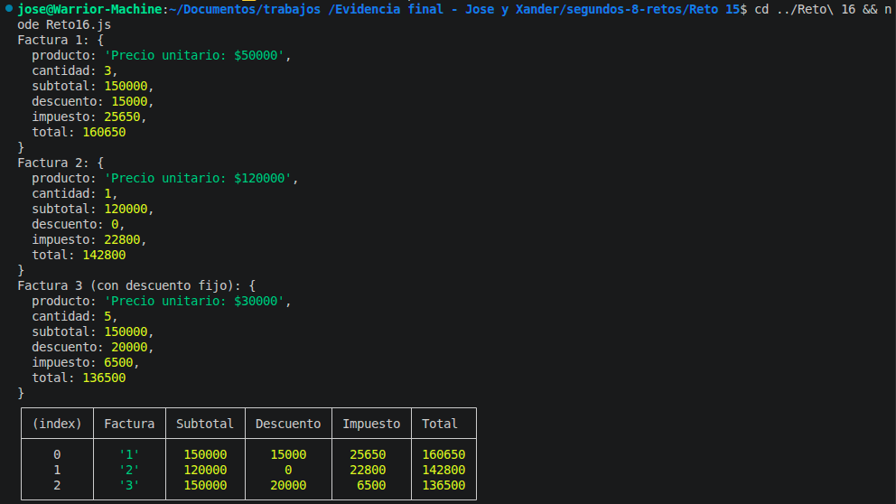

# Reto 16 - Generador de facturas modular

## 🎯 Objetivo
Construir funciones declaradas, expresiones y flechas para calcular subtotal, descuento, impuesto y generar factura.

## 🛠️ Requisitos
- Tener [Node.js](https://nodejs.org) instalado (versión LTS recomendada).
- Terminal o línea de comandos (Git Bash, CMD, PowerShell, Bash).

## ▶️ Cómo ejecutar
Abre una terminal en la raíz del repositorio.
Ejecuta:
```bash
cd segundos-8-retos/Reto\ 16
node Reto16.js
```
Verás las facturas generadas y una tabla comparativa.

## 🧠 Decisiones y proceso de solución

- `calcularSubtotal` es una función declarada (puede ser llamada antes de su definición).
- `calcularDescuento` es una expresión de función (no se eleva) y tiene un porcentaje por defecto 0.
- `calcularImpuesto` es una función flecha, también con parámetro por defecto (19%).
- La función principal `generarFactura` compone las demás sin conocer las fórmulas, solo las invoca.
- Implementé la extensión: acepta una función de descuento como callback; por defecto usa la porcentual, pero también creé un descuento fijo como alternativa.
- Validé que todos los datos de entrada sean números finitos y no negativos; en caso inválido retorna 0 para esa parte.
- La tabla final usa `console.table` para comparar las tres facturas.

## ⚠️ Dificultades encontradas

- Al principio la función de descuento fijo no tenía límite y podía descontar más que el subtotal; luego usé `Math.min` para evitar un total negativo.
- La extensión del callback me resultó interesante: tuve que pasar la función correcta y asegurarme de que la factura3 usara descuento fijo, no porcentual. José y yo repasamos por qué la primera versión de factura3 no aplicaba el descuento fijo porque olvidé pasar el callback.
- Recordar que la base gravable es el subtotal menos el descuento, no el subtotal directo, fue clave para el cálculo del impuesto.

## ✅ Pruebas realizadas

- [x] Factura 1: con precio, cantidad, descuento 10%, impuesto 19%.
- [x] Factura 2: usa valores por defecto (0% descuento, 19% impuesto).
- [x] Factura 3: con callback de descuento fijo de $20.000.
- [x] Tabla comparativa muestra subtotal, descuento, impuesto y total.

## 📸 Evidencia
*Reemplaza esta línea con la captura de pantalla de la terminal después de ejecutar el código.*
Objetos factura y tabla comparativa en consola.



---

> **Nota del autor (Xander):** Este reto me ayudó a practicar estructuras de control, funciones y trabajo en equipo. Si algo puede mejorar, ¡bienvenidas las sugerencias!
