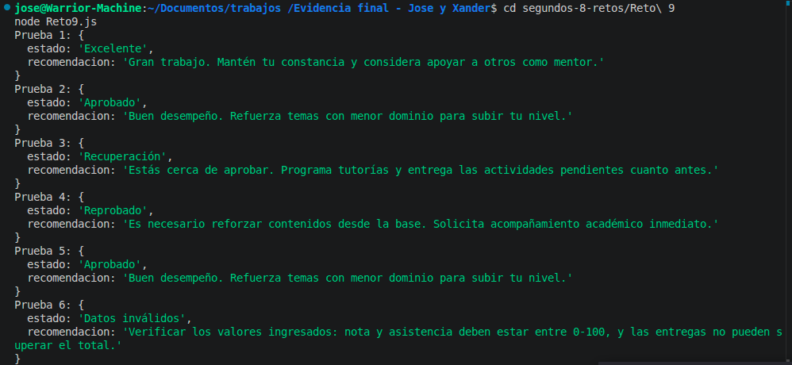

# Reto 09 - Clasificador de rendimiento académico

## 🎯 Objetivo
Asignar un estado final (Excelente, Aprobado, Recuperación, Reprobado) según nota, asistencia y entregas.

## 🛠️ Requisitos
- Tener [Node.js](https://nodejs.org) instalado (versión LTS recomendada).
- Terminal o línea de comandos (Git Bash, CMD, PowerShell, Bash).

## ▶️ Cómo ejecutar
Abre una terminal en la raíz del repositorio (donde están `primeros-8-retos` y `segundos-8-retos`).
Ejecuta:
```bash
cd segundos-8-retos/Reto\ 9
node Reto9.js
```
Verás las seis pruebas con su estado y recomendación.

## 🧠 Decisiones y proceso de solución

- Separé la validación de datos antes de clasificar, usando rangos estrictos (0-100) y comprobando que las entregas no superen el total.
- Ordené las condiciones desde la más específica (Excelente: nota alta, asistencia mínima del 80% y todas las entregas) hasta la más general (Reprobado).
- Usé comparaciones estrictas y operadores lógicos para que cada regla fuera clara.
- Agregué la extensión de mejora destacada: si la nota subió 15 puntos o más respecto al corte anterior, se añade una mención especial.
- Al principio olvidé usar la variable booleana `todasLasEntregas` y puse `totalEntregas` directamente en la condición, lo que provocaba que Excelente nunca se activara. José me ayudó a detectarlo y lo corregimos.
- También había confundido el nombre de la función en las pruebas y tenía errores de ortografía. Aprendí que nombrar bien las funciones desde el inicio ahorra tiempo.

## ⚠️ Dificultades encontradas

- La validación de datos me comió la cabeza: al principio retornaba "datos válidos" cuando en realidad eran inválidos. Tardé en notarlo porque las pruebas con datos fuera de rango mostraban un mensaje confuso.
- La condición para Excelente me falló porque usé `totalentregas` (el número) en vez del booleano `todaslasentregas`. José revisó el código y me dijo que así nunca se activaba. Fue un error tonto pero me enseñó a revisar bien los nombres de variables.

## ✅ Pruebas realizadas

- [x] Nota 95, asistencia 90%, 5/5 entregas → Excelente
- [x] Nota 75, asistencia 65%, 4/5 entregas → Aprobado
- [x] Nota 60, asistencia 55%, 3/5 entregas → Recuperación
- [x] Nota 40, asistencia 50%, 2/5 entregas → Reprobado
- [x] Nota 110 → Datos inválidos
- [x] Nota 92 con corte anterior 80 → mejora de 12 puntos, no activa mención (solo 15+)

## 📸 Evidencia
*Reemplaza esta línea con la captura de pantalla de la terminal después de ejecutar el código.*
Salida de la terminal mostrando las seis pruebas.



---

> **Nota del autor (Xander):** Este reto me ayudó a practicar estructuras de control, funciones y trabajo en equipo. Si algo puede mejorar, ¡bienvenidas las sugerencias!
