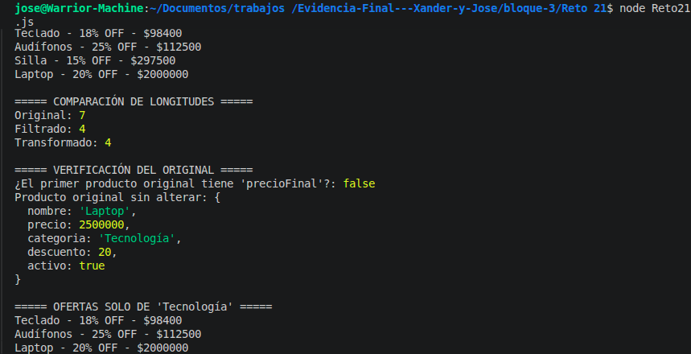

# Reto 21 - Generador de tablas de multiplicar

## 🎯 Objetivo
Mostrar la tabla de multiplicar de un número usando bucles for y while.

## 🛠️ Requisitos
- [Node.js](https://nodejs.org) instalado (versión LTS recomendada).
- Terminal o línea de comandos (Git Bash, CMD, PowerShell, Bash).

## ▶️ Cómo ejecutar
Abre una terminal en la raíz del repositorio y ejecuta:
```bash
cd bloque-3/Reto\ 21
node Reto21.js
```

## 🧠 Decisiones y proceso de solución
- Usé un bucle for para generar la tabla del 1 al 10.
- También implementé una versión con while para practicar ambos bucles.
- Formateé la salida con alineación para que sea legible.

## ⚠️ Dificultades encontradas
- En la versión while, olvidé incrementar el contador y causé un bucle infinito.
- Alinear los números en columnas requirió usar padStart.

## ✅ Pruebas realizadas
- [x] La tabla del 5 se genera correctamente del 1 al 10.
- [x] El formato de salida es legible y alineado.
- [x] Se muestra un mensaje si el número es 0 o negativo.
- [x] Ambas versiones (for y while) producen el mismo resultado.

## 📸 Evidencia
*Captura de pantalla de la terminal después de ejecutar el código.*



---

> **Nota:** Este reto forma parte del manual de JavaScript 2026. Desarrollado siguiendo los criterios de aceptación.
