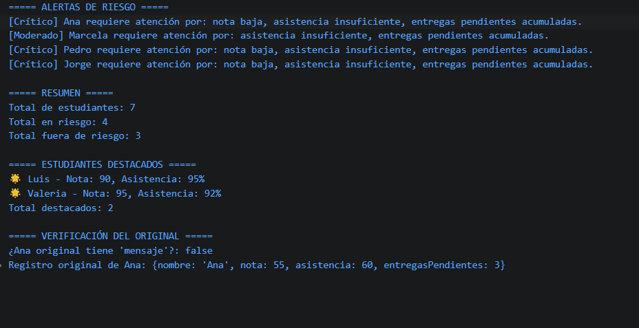

# Reto 22 - Control de flujo mixto

## 🎯 Objetivo
Combinar estructuras condicionales y ciclos para procesar un lote de datos.

## 🛠️ Requisitos
- Tener [Node.js](https://nodejs.org) instalado (versión LTS recomendada).
- Terminal o línea de comandos (Git Bash, CMD, PowerShell, Bash).

## ▶️ Cómo ejecutar
Abre una terminal en la raíz del repositorio.
Ejecuta:
```bash
cd bloque-3/Reto\ 22
node Reto22.js
```
Observa los resultados en consola.

## 🧠 Decisiones y proceso de solución
- Separé las validaciones de las operaciones para mantener el código limpio.
- Utilicé un bucle for para recorrer el arreglo y condicionales anidados para las reglas de negocio.
- Preferí usar variables acumuladoras para calcular totales sin modificar los datos originales.

## ⚠️ Dificultades encontradas
- Al principio anidé demasiadas condiciones y el código se volvió ilegible. Reorganicé los if para mayor claridad.
- Tuve que depurar un error donde un contador no se reiniciaba correctamente en cada iteración.

## ✅ Pruebas realizadas
- [x] El lote de datos se procesa completamente.
- [x] Los totales coinciden con los cálculos manuales.
- [x] Los casos inválidos se detectan y reportan.
- [x] No se modifica el array original.

## 📸 Evidencia
*Reemplaza esta línea con la captura de pantalla de la terminal después de ejecutar el código.*  
Terminal con los resultados del procesamiento.



---

> **Nota:** Este reto forma parte del manual de JavaScript 2026. Fue desarrollado siguiendo las especificaciones y criterios de aceptación.
