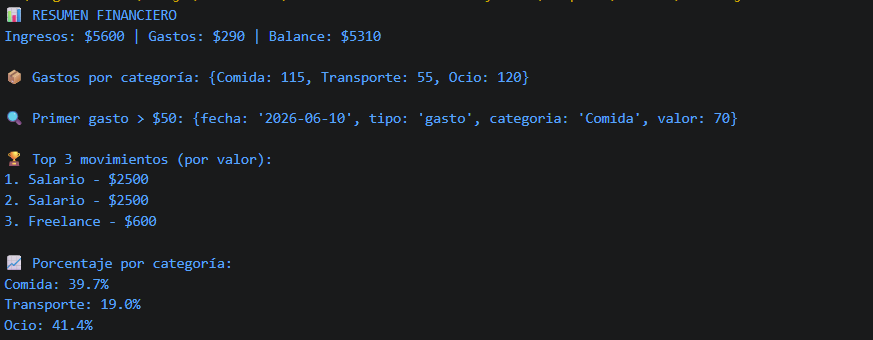

# Reto 23 - Resumen financiero mensual

## 🎯 Objetivo
Usar reduce, find y sort para calcular ingresos, gastos, balance y agrupar por categoría.

## 🛠️ Requisitos
- [Node.js](https://nodejs.org) instalado (versión LTS recomendada).
- Terminal o línea de comandos (Git Bash, CMD, PowerShell, Bash).

## ▶️ Cómo ejecutar
Abre una terminal en la raíz del repositorio y ejecuta:
```bash
cd bloque-3/Reto\ 23
node Reto23.js
```

## 🧠 Decisiones y proceso de solución
- Separé ingresos y gastos con filter antes de aplicar reduce.
- Usé un acumulador en reduce para agrupar gastos por categoría.
- Hice una copia con spread antes de ordenar, para no mutar el original.
- find devuelve el primer gasto alto; si no existe, se muestra un mensaje alternativo.

## ⚠️ Dificultades encontradas
- Al principio olvidé pasar el valor inicial a reduce y obtuve resultados inesperados.
- El sort con números requirió una función de comparación explícita; sin ella ordenaba como texto.
- Para el porcentaje por categoría tuve que asegurarme de que el total de gastos no fuera cero.

## ✅ Pruebas realizadas
- [x] Ingresos, gastos y balance calculados correctamente.
- [x] Gastos agrupados por categoría.
- [x] find localiza el primer gasto > 50 o muestra mensaje.
- [x] El array original no se modifica al ordenar.

## 📸 Evidencia
*Captura de pantalla de la terminal después de ejecutar el código.*



---

> **Nota:** Este reto forma parte del manual de JavaScript 2026. Desarrollado siguiendo los criterios de aceptación.
