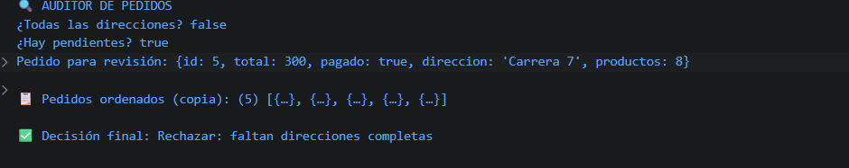

# Reto 24 - Auditor de pedidos

## 🎯 Objetivo
Usar every, some y find para validar pedidos y tomar una decisión automatizada.

## 🛠️ Requisitos
- [Node.js](https://nodejs.org) instalado (versión LTS recomendada).
- Terminal o línea de comandos (Git Bash, CMD, PowerShell, Bash).

## ▶️ Cómo ejecutar
Abre una terminal en la raíz del repositorio y ejecuta:
```bash
cd bloque-3/Reto\ 24
node Reto24.js
```

## 🧠 Decisiones y proceso de solución
- every verifica que todas las direcciones estén completas.
- some detecta pedidos sin pagar o con total cero (suficiente con un caso).
- find busca el primer pedido que supera un valor de revisión manual.
- La decisión final sigue un orden de prioridad: rechazar, revisar o aprobar.

## ⚠️ Dificultades encontradas
- Comprendí que some se detiene al primer true, lo que lo hace eficiente para detectar problemas.
- Al usar comparaciones numéricas en sort tuve que usar resta para orden correcto.
- La copia para ordenar la hice con spread para no alterar los pedidos originales.

## ✅ Pruebas realizadas
- [x] Se detecta la falta de direcciones completas.
- [x] Se identifican pedidos pendientes.
- [x] El pedido de revisión se encuentra correctamente.
- [x] La decisión final es reproducible.

## 📸 Evidencia
*Captura de pantalla de la terminal después de ejecutar el código.*



---

> **Nota:** Este reto forma parte del manual de JavaScript 2026. Desarrollado siguiendo los criterios de aceptación.
