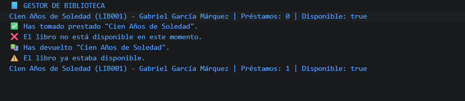

# Reto 25 - Gestor de biblioteca

## 🎯 Objetivo
Crear un objeto libro con métodos prestar, devolver y obtenerResumen usando this.

## 🛠️ Requisitos
- Tener [Node.js](https://nodejs.org) instalado (versión LTS recomendada).
- Terminal o línea de comandos (Git Bash, CMD, PowerShell, Bash).

## ▶️ Cómo ejecutar
Abre una terminal en la raíz del repositorio.
Ejecuta:
```bash
cd bloque-4/Reto\ 25
node Reto25.js
```
Observa los resultados en consola.

## 🧠 Decisiones y proceso de solución
- Los métodos están dentro del objeto, accediendo a this para modificar el estado.
- prestar verifica disponibilidad antes de cambiar el estado e incrementa el contador.
- devolver solo actúa si el libro no está disponible, restaurando la disponibilidad.
- obtenerResumen devuelve un string con el estado actual.

## ⚠️ Dificultades encontradas
- Entender que this dentro de un método normal apunta al objeto que lo llama.
- Al principio olvidé devolver un mensaje cuando el préstamo era rechazado.
- Tuve que comprobar que el contador de préstamos aumentara solo en préstamos exitosos.

## ✅ Pruebas realizadas
- [x] Préstamo exitoso cambia disponibilidad y contador.
- [x] Préstamo duplicado se rechaza.
- [x] Devolución restaura el estado.
- [x] Resumen muestra todos los cambios.

## 📸 Evidencia
*Reemplaza esta línea con la captura de pantalla de la terminal después de ejecutar el código.*  
Terminal mostrando secuencia de préstamo y devolución.



---

> **Nota:** Este reto forma parte del manual de JavaScript 2026. Fue desarrollado siguiendo las especificaciones y criterios de aceptación.
