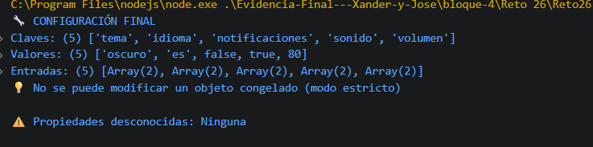

# Reto 26 - Comparador de configuraciones

## 🎯 Objetivo
Fusionar configuración por defecto con preferencias del usuario, congelar y detectar propiedades desconocidas.

## 🛠️ Requisitos
- Tener [Node.js](https://nodejs.org) instalado (versión LTS recomendada).
- Terminal o línea de comandos (Git Bash, CMD, PowerShell, Bash).

## ▶️ Cómo ejecutar
Abre una terminal en la raíz del repositorio.
Ejecuta:
```bash
cd bloque-4/Reto\ 26
node Reto26.js
```
Observa los resultados en consola.

## 🧠 Decisiones y proceso de solución
- Usé spread para fusionar objetos: las preferencias del usuario sobrescriben las del defecto.
- Detectar propiedades desconocidas lo hice comparando claves con Object.keys.
- Object.freeze en modo estricto lanza error al modificar, lo comprobé con un try/catch.

## ⚠️ Dificultades encontradas
- Comprendí que spread no hace fusión profunda, pero aquí bastaba.
- El valor false en preferencias es válido y no debe ser reemplazado por el defecto; spread lo respeta.
- Object.freeze solo es efectivo en modo estricto para lanzar error visible.

## ✅ Pruebas realizadas
- [x] Las preferencias sobrescriben correctamente.
- [x] false no se reemplaza por accidente.
- [x] Propiedades desconocidas se reportan.
- [x] El objeto congelado no puede modificarse.

## 📸 Evidencia
*Reemplaza esta línea con la captura de pantalla de la terminal después de ejecutar el código.*  
Terminal mostrando objeto final y mensajes de propiedades desconocidas.



---

> **Nota:** Este reto forma parte del manual de JavaScript 2026. Fue desarrollado siguiendo las especificaciones y criterios de aceptación.
