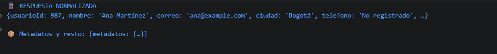

# Reto 27 - Normalizador de respuestas API

## 🎯 Objetivo
Extraer, renombrar y dar valores por defecto con desestructuración.

## 🛠️ Requisitos
- Tener [Node.js](https://nodejs.org) instalado (versión LTS recomendada).
- Terminal o línea de comandos (Git Bash, CMD, PowerShell, Bash).

## ▶️ Cómo ejecutar
Abre una terminal en la raíz del repositorio.
Ejecuta:
```bash
cd bloque-4/Reto\ 27
node Reto27.js
```
Observa los resultados en consola.

## 🧠 Decisiones y proceso de solución
- Desestructure el objeto anidando para obtener ciudad desde ubicacion.
- Renombré id a usuarioId y usé rest para separar metadatos.
- Asigné valor por defecto a teléfono al no existir en la respuesta.

## ⚠️ Dificultades encontradas
- La desestructuración de varios niveles puede volverse confusa; preferí legibilidad.
- Rest captura todas las propiedades no desestructuradas, lo que simplificó la extracción.
- Verifiqué que el objeto original permaneciera intacto después de todo el proceso.

## ✅ Pruebas realizadas
- [x] Nombres renombrados correctamente.
- [x] Valor por defecto para teléfono aparece.
- [x] Rest reúne las propiedades restantes.
- [x] El objeto final contiene solo lo necesario.

## 📸 Evidencia
*Reemplaza esta línea con la captura de pantalla de la terminal después de ejecutar el código.*  
Terminal con el objeto normalizado y los metadatos.



---

> **Nota:** Este reto forma parte del manual de JavaScript 2026. Fue desarrollado siguiendo las especificaciones y criterios de aceptación.
