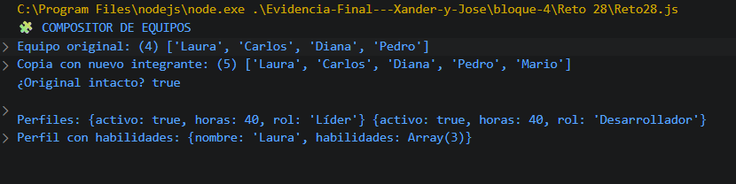

# Reto 28 - Compositor de equipos

## 🎯 Objetivo
Usar spread en arrays y objetos, y parámetros rest en funciones.

## 🛠️ Requisitos
- Tener [Node.js](https://nodejs.org) instalado (versión LTS recomendada).
- Terminal o línea de comandos (Git Bash, CMD, PowerShell, Bash).

## ▶️ Cómo ejecutar
Abre una terminal en la raíz del repositorio.
Ejecuta:
```bash
cd bloque-4/Reto\ 28
node Reto28.js
```
Observa los resultados en consola.

## 🧠 Decisiones y proceso de solución
- Uní dos arrays con spread para no mutar los originales.
- Creé perfiles combinando un objeto base con spread, sobrescribiendo el rol.
- La función registrarHabilidades usa rest para aceptar un número variable de habilidades.
- Eliminé duplicados convirtiendo a Set y luego a array.

## ⚠️ Dificultades encontradas
- Diferenciar spread (expandir) de rest (recoger) me ayudó a ubicarlos correctamente.
- Al copiar el equipo y añadir un miembro, verifiqué que el original no cambiara.
- El Set elimina duplicados, pero tuve que convertirlo de nuevo a array para usarlo.

## ✅ Pruebas realizadas
- [x] Los equipos se combinan en orden.
- [x] Los perfiles conservan propiedades base.
- [x] Las habilidades variables se registran sin duplicados.
- [x] Los originales permanecen iguales.

## 📸 Evidencia
*Reemplaza esta línea con la captura de pantalla de la terminal después de ejecutar el código.*  
Terminal mostrando equipos combinados y perfiles.



---

> **Nota:** Este reto forma parte del manual de JavaScript 2026. Fue desarrollado siguiendo las especificaciones y criterios de aceptación.
