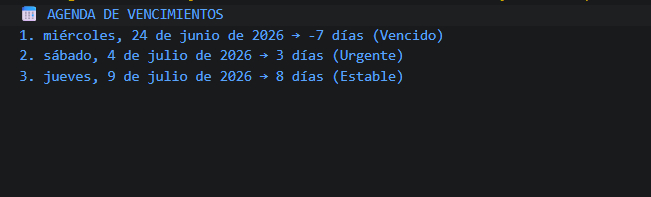

# Reto 29 - Agenda de vencimientos

## 🎯 Objetivo
Calcular días restantes, clasificar urgencia y formatear fechas con Intl.

## 🛠️ Requisitos
- Tener [Node.js](https://nodejs.org) instalado (versión LTS recomendada).
- Terminal o línea de comandos (Git Bash, CMD, PowerShell, Bash).

## ▶️ Cómo ejecutar
Abre una terminal en la raíz del repositorio.
Ejecuta:
```bash
cd bloque-4/Reto\ 29
node Reto29.js
```
Observa los resultados en consola.

## 🧠 Decisiones y proceso de solución
- Las fechas las construí con new Date usando formato ISO para evitar ambigüedades.
- La diferencia en días la obtuve restando timestamps y convirtiendo milisegundos a días.
- Clasifiqué según días: vencido (<0), urgente (0-3), próximo (4-7), estable (>7).
- Formateé con Intl.DateTimeFormat en es-CO para localización.

## ⚠️ Dificultades encontradas
- Al restar fechas, el signo negativo indica vencimiento; tuve que considerarlo.
- Las fechas se comparan numéricamente con getTime, no como texto.
- Aprendí que Intl.DateTimeFormat es más fiable que toLocaleDateString.

## ✅ Pruebas realizadas
- [x] Los días restantes se calculan correctamente.
- [x] Las fechas se muestran en formato colombiano.
- [x] El orden cronológico es correcto.
- [x] Las vencidas reciben estado especial.

## 📸 Evidencia
*Reemplaza esta línea con la captura de pantalla de la terminal después de ejecutar el código.*  
Terminal con agenda de vencimientos y estados.



---

> **Nota:** Este reto forma parte del manual de JavaScript 2026. Fue desarrollado siguiendo las especificaciones y criterios de aceptación.
