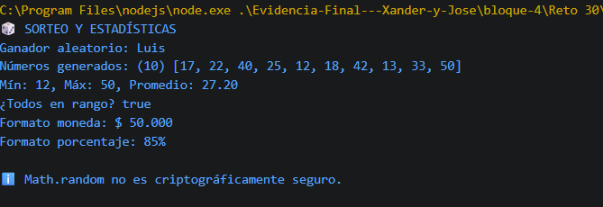

# Reto 30 - Sorteo reproducible y estadísticas

## 🎯 Objetivo
Generar números aleatorios, calcular estadísticas y formatear con Intl.NumberFormat.

## 🛠️ Requisitos
- Tener [Node.js](https://nodejs.org) instalado (versión LTS recomendada).
- Terminal o línea de comandos (Git Bash, CMD, PowerShell, Bash).

## ▶️ Cómo ejecutar
Abre una terminal en la raíz del repositorio.
Ejecuta:
```bash
cd bloque-4/Reto\ 30
node Reto30.js
```
Observa los resultados en consola.

## 🧠 Decisiones y proceso de solución
- Usé Math.floor con Math.random para obtener un índice entero seguro.
- Para generar números en un rango, calculé el tamaño del rango y sumé el mínimo.
- Math.min, Math.max, reduce y every me dieron las estadísticas requeridas.
- Apliqué Intl.NumberFormat para moneda y porcentaje.

## ⚠️ Dificultades encontradas
- El límite superior en Math.random requiere sumar 1 al rango; lo documenté.
- Verifiqué que todos los números generados estuvieran dentro del rango con every.
- Recordé que Math.random no es criptográficamente seguro; lo menciono en el código.

## ✅ Pruebas realizadas
- [x] El índice aleatorio siempre existe dentro del array.
- [x] Los diez números están dentro del rango especificado.
- [x] Estadísticas (mín, máx, promedio) correctas.
- [x] Formatos localizados legibles.

## 📸 Evidencia
*Reemplaza esta línea con la captura de pantalla de la terminal después de ejecutar el código.*  
Terminal con resultados del sorteo y estadísticas.



---

> **Nota:** Este reto forma parte del manual de JavaScript 2026. Fue desarrollado siguiendo las especificaciones y criterios de aceptación.
