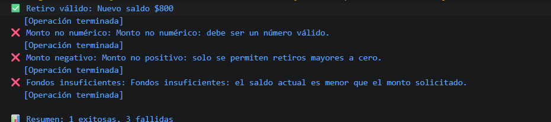

# Reto 31 - Cajero seguro

## 🎯 Objetivo
Lanzar y capturar errores específicos con try/catch/finally.

## 🛠️ Requisitos
- Tener [Node.js](https://nodejs.org) instalado (versión LTS recomendada).
- Terminal o línea de comandos (Git Bash, CMD, PowerShell, Bash).

## ▶️ Cómo ejecutar
Abre una terminal en la raíz del repositorio.
Ejecuta:
```bash
cd bloque-4/Reto\ 31
node Reto31.js
```
Observa los resultados en consola.

## 🧠 Decisiones y proceso de solución
- Validé primero el tipo de monto, luego positividad y finalmente fondos.
- Lancé errores descriptivos con new Error para cada caso inválido.
- finally se usó para registrar el fin de la operación, independientemente del resultado.
- Conté éxitos y fallos para el resumen final.

## ⚠️ Dificultades encontradas
- Diferenciar Error de otros valores en catch fue necesario para leer message.
- Al principio puse catch vacío, pero luego lo completé con mensajes.
- finally se ejecutó siempre, incluso cuando no lo esperaba por los throw.

## ✅ Pruebas realizadas
- [x] Retiro válido modifica el saldo.
- [x] Los errores específicos muestran mensajes claros.
- [x] finally se ejecuta en todos los escenarios.
- [x] Resumen de operaciones exitosas y fallidas.

## 📸 Evidencia
*Reemplaza esta línea con la captura de pantalla de la terminal después de ejecutar el código.*  
Terminal con las cuatro pruebas y el resumen.



---

> **Nota:** Este reto forma parte del manual de JavaScript 2026. Fue desarrollado siguiendo las especificaciones y criterios de aceptación.
