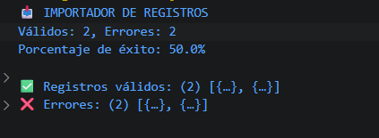

# Reto 32 - Importador de registros

## 🎯 Objetivo
Validar registros uno a uno sin detener el proceso, usando try/catch por registro.

## 🛠️ Requisitos
- Tener [Node.js](https://nodejs.org) instalado (versión LTS recomendada).
- Terminal o línea de comandos (Git Bash, CMD, PowerShell, Bash).

## ▶️ Cómo ejecutar
Abre una terminal en la raíz del repositorio.
Ejecuta:
```bash
cd bloque-4/Reto\ 32
node Reto32.js
```
Observa los resultados en consola.

## 🧠 Decisiones y proceso de solución
- Creé una función validarRegistro reutilizable que lanza errores detallados.
- Procesé cada registro en un try/catch independiente para no detener el lote.
- Los válidos y los errores se guardan en arrays separados.
- Calculé el porcentaje de éxito para el resumen.

## ⚠️ Dificultades encontradas
- Colocar el try/catch dentro del forEach fue clave para no interrumpir el flujo.
- Incluí el índice y el dato original en el reporte de error para facilitar la corrección.
- Tuve cuidado de no modificar los registros originales; los válidos se normalizaron en una copia.

## ✅ Pruebas realizadas
- [x] Todos los registros se intentan procesar.
- [x] Válidos y errores quedan separados.
- [x] Los mensajes de error incluyen índice y causa.
- [x] El porcentaje de éxito coincide.

## 📸 Evidencia
*Reemplaza esta línea con la captura de pantalla de la terminal después de ejecutar el código.*  
Terminal con arrays de válidos y errores, y el porcentaje.



---

> **Nota:** Este reto forma parte del manual de JavaScript 2026. Fue desarrollado siguiendo las especificaciones y criterios de aceptación.
