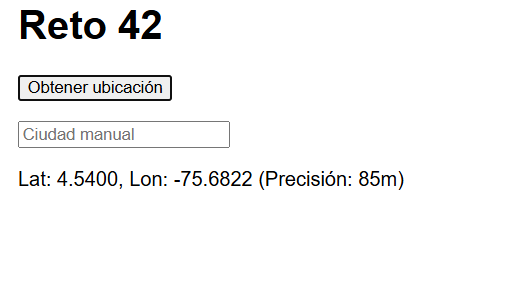

# Reto 42 - Ubicación con alternativa

## 🎯 Objetivo
Solicitar geolocalización con manejo de errores y ofrecer entrada manual.

## 🛠️ Requisitos
- Navegador web moderno (Chrome, Firefox, Edge).
- [Visual Studio Code](https://code.visualstudio.com/) (opcional, pero muy recomendado).
- Extensión **Live Server** para VS Code (facilita la ejecución y prueba).

## ▶️ Cómo ejecutar

### 🌐 Opción 1: Usando Visual Studio Code y Live Server (Recomendado)

1. **Instala Visual Studio Code**  
   Si no lo tienes, descárgalo gratis desde [https://code.visualstudio.com/](https://code.visualstudio.com/) e instálalo.

2. **Instala la extensión Live Server**  
   - Abre VS Code.  
   - Ve a la pestaña de extensiones (icono de cuadros en la barra izquierda, o presiona `Ctrl+Shift+X`).  
   - Busca **"Live Server"** (tiene un ícono morado).  
   - Haz clic en **Instalar** y espera unos segundos.

3. **Abre la carpeta del reto en VS Code**  
   - En VS Code, ve al menú `Archivo > Abrir carpeta...` (o `File > Open Folder...`).  
   - Busca y selecciona la carpeta **`Reto 42`** que está dentro de **`bloque-6`** en este repositorio.  
   - Por ejemplo, la ruta completa podría ser:  
     ```bash
     .../Evidencia final - Jose y Xander/bloque-6/Reto 42
     ```

4. **Inicia Live Server**  
   - En el panel izquierdo de VS Code, verás el archivo `index.html`.  
   - Haz clic derecho sobre `index.html` y selecciona la opción **`Open with Live Server`**.  
   - El navegador se abrirá automáticamente y cargará el reto.

5. **Ya puedes interactuar con el reto**  
   Cada vez que modifiques y guardes el código, Live Server recargará la página al instante. ¡Perfecto para hacer pruebas!

---

### 🖱️ Opción 2: Abrir directamente con el navegador (Sin instalar nada)

1. Abre tu explorador de archivos (el de Windows, Linux o macOS).
2. Navega hasta la carpeta **`Reto 42`** dentro de este repositorio.
3. Haz **doble clic** sobre el archivo `index.html`.
4. Se abrirá en tu navegador predeterminado y podrás ver el reto en acción.

> ⚠️ **Nota:** Con este método no verás recarga automática al editar el código. Deberás recargar manualmente la página (F5) tras cada cambio.

---

### 📝 ¿Qué debo ver?
Al abrir el `index.html`, el navegador mostrará la interfaz del reto. Por ejemplo, botones, formularios o una tarjeta. El script `Reto42.js` se encarga de toda la lógica automáticamente.


## 🧠 Decisiones y proceso de solución
- La solicitud de geolocalización solo se hace al hacer clic en el botón.
- Muestro un estado de carga mientras se espera la respuesta.
- Diferencio los tres códigos de error (PERMISSION_DENIED, POSITION_UNAVAILABLE, TIMEOUT) con mensajes claros.
- El campo de ciudad manual siempre está disponible; al escribir se muestra la ciudad ingresada.
- Uso un timeout de 10 segundos para evitar bloqueos.

## ⚠️ Dificultades encontradas
- Al denegar el permiso en el navegador, el error no se mostraba porque olvidé pasar la función de error como segundo callback. Lo corregí.
- La propiedad code del error no es un string, sino un número; usé las constantes del objeto error (err.PERMISSION_DENIED, etc.) para comparar.
- Al principio el estado de carga no desaparecía si el usuario cancelaba manualmente; agregué un finally lógico con un setTimeout extra, pero luego opté por mostrar/ocultar con una variable booleana.

## ✅ Pruebas realizadas
- [x] Al permitir ubicación, se muestran latitud y longitud.
- [x] Al denegar, aparece el mensaje de permiso denegado.
- [x] La ciudad manual se puede escribir y se refleja.
- [x] El estado "Obteniendo ubicación..." aparece y se quita al terminar.

## 📸 Evidencia
*Reemplaza esta línea con la captura de pantalla del navegador después de ejecutar el reto.*  
Navegador mostrando coordenadas o el mensaje de error y la ciudad manual.



---

> **Nota:** Este reto forma parte del manual de JavaScript 2026. Fue desarrollado siguiendo las especificaciones y criterios de aceptación.
