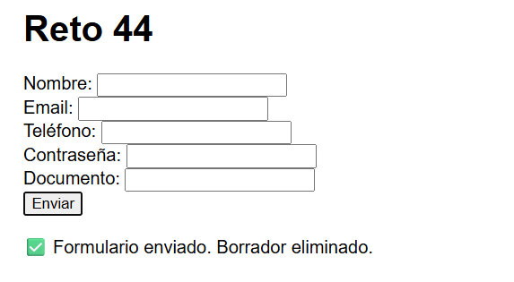

# Reto 44 - Asistente de formulario por sesión

## 🎯 Objetivo
Usar sessionStorage para guardar avance de formulario, excluyendo datos sensibles.

## 🛠️ Requisitos
- Navegador web moderno (Chrome, Firefox, Edge).
- [Visual Studio Code](https://code.visualstudio.com/) (opcional, pero muy recomendado).
- Extensión **Live Server** para VS Code (facilita la ejecución y prueba).

## ▶️ Cómo ejecutar

### 🌐 Opción 1: Usando Visual Studio Code y Live Server (Recomendado)

1. **Instala Visual Studio Code**  
   Si no lo tienes, descárgalo gratis desde [https://code.visualstudio.com/](https://code.visualstudio.com/) e instálalo.

2. **Instala la extensión Live Server**  
   - Abre VS Code.  
   - Ve a la pestaña de extensiones (icono de cuadros en la barra izquierda, o presiona `Ctrl+Shift+X`).  
   - Busca **"Live Server"** (tiene un ícono morado).  
   - Haz clic en **Instalar** y espera unos segundos.

3. **Abre la carpeta del reto en VS Code**  
   - En VS Code, ve al menú `Archivo > Abrir carpeta...` (o `File > Open Folder...`).  
   - Busca y selecciona la carpeta **`Reto 44`** que está dentro de **`bloque-6`** en este repositorio.  
   - Por ejemplo, la ruta completa podría ser:  
     ```bash
     .../Evidencia final - Jose y Xander/bloque-6/Reto 44
     ```

4. **Inicia Live Server**  
   - En el panel izquierdo de VS Code, verás el archivo `index.html`.  
   - Haz clic derecho sobre `index.html` y selecciona la opción **`Open with Live Server`**.  
   - El navegador se abrirá automáticamente y cargará el reto.

5. **Ya puedes interactuar con el reto**  
   Cada vez que modifiques y guardes el código, Live Server recargará la página al instante. ¡Perfecto para hacer pruebas!

---

### 🖱️ Opción 2: Abrir directamente con el navegador (Sin instalar nada)

1. Abre tu explorador de archivos (el de Windows, Linux o macOS).
2. Navega hasta la carpeta **`Reto 44`** dentro de este repositorio.
3. Haz **doble clic** sobre el archivo `index.html`.
4. Se abrirá en tu navegador predeterminado y podrás ver el reto en acción.

> ⚠️ **Nota:** Con este método no verás recarga automática al editar el código. Deberás recargar manualmente la página (F5) tras cada cambio.

---

### 📝 ¿Qué debo ver?
Al abrir el `index.html`, el navegador mostrará la interfaz del reto. Por ejemplo, botones, formularios o una tarjeta. El script `Reto44.js` se encarga de toda la lógica automáticamente.


## 🧠 Decisiones y proceso de solución
- Defino un array de campos permitidos (nombre, email, teléfono) y otro de sensibles (password, documento).
- Al cambiar cualquier campo permitido, guardo un objeto en sessionStorage.
- Al cargar la página, restauro los valores de los campos permitidos.
- Los campos sensibles se excluyen explícitamente y nunca se tocan.
- Al enviar el formulario, se borra el borrador y se muestra un mensaje de éxito.

## ⚠️ Dificultades encontradas
- Al principio guardaba todo el formulario, incluyendo contraseñas. El instructor me advirtió y creé la lista blanca.
- Tuve que comprobar si los elementos existían antes de setear .value, porque al añadir campos nuevos podría olvidar algún id y romper la consola.
- El aviso de privacidad no se veía; lo coloqué como un párrafo fijo que se actualiza con cada acción.

## ✅ Pruebas realizadas
- [x] Llenar campos permitidos, recargar: se restauran.
- [x] Campos sensibles aparecen vacíos tras recargar.
- [x] Enviar el formulario limpia sessionStorage y los campos.
- [x] El aviso de privacidad se muestra al guardar y al restaurar.

## 📸 Evidencia
*Reemplaza esta línea con la captura de pantalla del navegador después de ejecutar el reto.*  
Navegador con campos restaurados y aviso de sesión.



---

> **Nota:** Este reto forma parte del manual de JavaScript 2026. Fue desarrollado siguiendo las especificaciones y criterios de aceptación.
