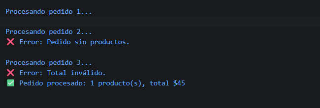

# Reto 47 - Procesador de pedidos con callback

## 🎯 Objetivo
Diseñar callbacks de éxito y error para una función asíncrona simulada.

## 🛠️ Requisitos
- Tener [Node.js](https://nodejs.org) instalado (versión LTS recomendada).
- Terminal o línea de comandos (Git Bash, CMD, PowerShell, Bash).

## ▶️ Cómo ejecutar
Abre una terminal en la raíz del repositorio.
Ejecuta:
```bash
cd bloque-6/Reto\ 47
node Reto47.js
```
Observa los resultados en consola.

## 🧠 Decisiones y proceso de solución
- La función procesarPedido recibe un callback onSuccess y otro onError.
- Valida el pedido antes de simular la demora con setTimeout.
- Invoca exactamente un callback según el resultado.
- Incluí una reflexión sobre cómo el anidamiento se vuelve complejo si se encadenaran más tareas.

## ⚠️ Dificultades encontradas
- Entender que el return de la función externa ocurre antes que el callback, por lo que no se puede retornar el resultado directamente.
- Al principio intenté lanzar un error, pero recordé que en una función asíncrona simulada se debe invocar el callback de error.
- Documentar la complejidad del anidamiento me ayudó a valorar las promesas.

## ✅ Pruebas realizadas
- [x] Cada pedido produce éxito o error según validación.
- [x] La demora con setTimeout se nota en la salida (los logs aparecen después).
- [x] No se invocan ambos callbacks para un mismo pedido.
- [x] La reflexión sobre anidamiento está escrita en comentarios.

## 📸 Evidencia
*Reemplaza esta línea con la captura de pantalla de la terminal después de ejecutar el código.*  
Terminal mostrando los resultados de los tres pedidos con delay.



---

> **Nota:** Este reto forma parte del manual de JavaScript 2026. Fue desarrollado siguiendo las especificaciones y criterios de aceptación.
