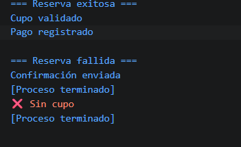

# Reto 48 - Cadena de reserva con Promise

## 🎯 Objetivo
Encadenar promesas para validar cupo, registrar pago y emitir confirmación.

## 🛠️ Requisitos
- Tener [Node.js](https://nodejs.org) instalado (versión LTS recomendada).
- Terminal o línea de comandos (Git Bash, CMD, PowerShell, Bash).

## ▶️ Cómo ejecutar
Abre una terminal en la raíz del repositorio.
Ejecuta:
```bash
cd bloque-6/Reto\ 48
node Reto48.js
```
Observa los resultados en consola.

## 🧠 Decisiones y proceso de solución
- Cada etapa devuelve una nueva Promise, permitiendo encadenamiento con .then().
- Las funciones se encadenan en orden, y un rechazo detiene las etapas posteriores.
- finally se usa para cerrar un indicador de proceso.
- Incluí pruebas de reserva exitosa y fallida para verificar el catch.

## ⚠️ Dificultades encontradas
- Al principio anidé .then() innecesariamente; luego aprendí a retornar cada promesa para una cadena plana.
- Asegurar que el catch capture el rechazo de cualquier etapa fue sencillo, pero tuve que probar en qué punto fallaba.
- finally se ejecuta en ambos casos, algo que no esperaba al inicio.

## ✅ Pruebas realizadas
- [x] Las etapas exitosas respetan el orden.
- [x] La falla en validarCupo detiene el resto.
- [x] catch recibe la causa del rechazo.
- [x] finally se ejecuta tanto en éxito como en error.

## 📸 Evidencia
*Reemplaza esta línea con la captura de pantalla de la terminal después de ejecutar el código.*  
Terminal con la salida de las dos pruebas (exitosa y fallida).



---

> **Nota:** Este reto forma parte del manual de JavaScript 2026. Fue desarrollado siguiendo las especificaciones y criterios de aceptación.
