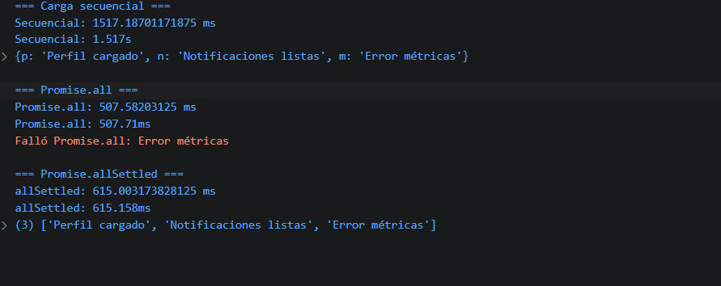

# Reto 50 - Carga paralela de panel

## 🎯 Objetivo
Comparar carga secuencial, Promise.all y Promise.allSettled para tareas independientes.

## 🛠️ Requisitos
- Tener [Node.js](https://nodejs.org) instalado (versión LTS recomendada).
- Terminal o línea de comandos (Git Bash, CMD, PowerShell, Bash).

## ▶️ Cómo ejecutar
Abre una terminal en la raíz del repositorio.
Ejecuta:
```bash
cd bloque-7/Reto\ 50
node Reto50.js
```
Observa los resultados en consola.

## 🧠 Decisiones y proceso de solución
- Simulé tres tareas asíncronas con tiempos distintos y una de ellas rechaza.
- Medí tiempos con console.time en cada estrategia.
- Promise.all falla completamente ante un rechazo; Promise.allSettled devuelve el estado de cada promesa.
- Documenté las diferencias en comentarios y en la salida.

## ⚠️ Dificultades encontradas
- Al principio pensé que Promise.all también devolvía resultados parciales; tuve que probarlo para entenderlo.
- allSettled siempre devuelve un array de objetos con status y value/reason, lo que obliga a procesarlo distinto.
- Aseguré que las tareas independientes se ejecutaran en paralelo, no en secuencia.

## ✅ Pruebas realizadas
- [x] La versión paralela con allSettled obtiene los resultados de las tres.
- [x] Promise.all se rechaza ante la métrica fallida.
- [x] La carga secuencial toma más tiempo que la paralela.
- [x] La comparación queda documentada en la salida.

## 📸 Evidencia
*Reemplaza esta línea con la captura de pantalla de la terminal después de ejecutar el código.*  
Terminal con los tiempos y resultados de las tres estrategias.



---

> **Nota:** Este reto forma parte del manual de JavaScript 2026. Fue desarrollado siguiendo las especificaciones y criterios de aceptación.
