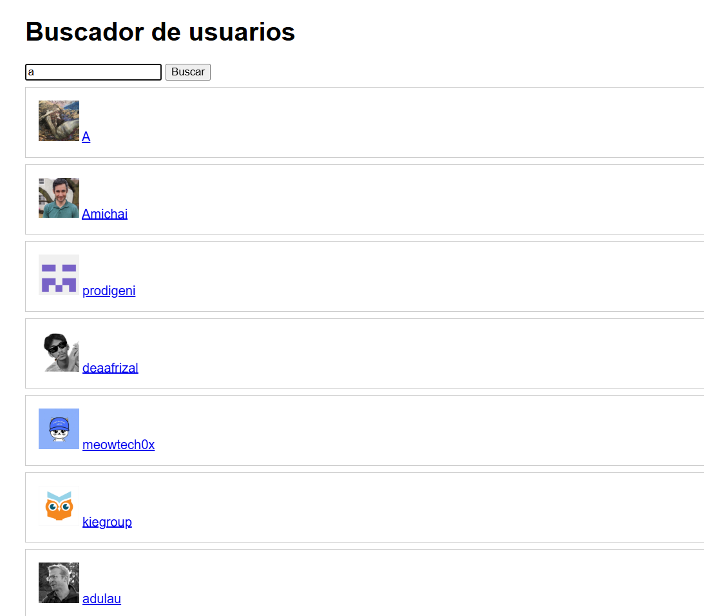

# Reto 51 - Buscador de usuarios remoto

## 🎯 Objetivo
Consumir una API pública con fetch, validar la respuesta HTTP y mostrar resultados en el DOM.

## 🛠️ Requisitos
- Navegador web moderno (Chrome, Firefox, Edge).
- [Visual Studio Code](https://code.visualstudio.com/) y Live Server (recomendado para mejor experiencia).

## ▶️ Cómo ejecutar
### 🌐 Usando Live Server (recomendado)
1. Abre la carpeta del reto en VS Code.
2. Haz clic derecho en `index.html` → **Open with Live Server**.
3. Escribe un nombre de usuario de GitHub (ej. `torvalds`) y presiona Enter.
4. La página mostrará los resultados o un mensaje de estado.

> 💡 También puedes abrir el HTML con doble clic, aunque Live Server evita problemas de CORS en algunos casos.

## 🧠 Decisiones y proceso de solución
- Construí la URL con URL y URLSearchParams para evitar concatenaciones inseguras.
- Verifiqué response.ok para capturar errores HTTP; fetch solo rechaza en errores de red.
- Rendericé los datos con createElement e innerHTML (controlado) para mostrar avatares y enlaces.
- Mostré estados intermedios: cargando, vacío y error.

## ⚠️ Dificultades encontradas
- Al principio pensé que fetch rechazaba para 404, pero el error no se capturaba. Aprendí a validar response.ok.
- Al poner el script sin defer, el formulario no se encontraba. Lo solucioné agregando defer.
- Tuve que recordar que la API de GitHub tiene límites de rate; si haces muchas peticiones seguidas puede responder 403.

## ✅ Pruebas realizadas
- [x] Buscar un usuario existente muestra avatar y enlace.
- [x] Buscar un nombre inexistente muestra "Sin resultados".
- [x] Si falla la red, se muestra un mensaje de error.
- [x] El campo vacío no lanza búsqueda.

## 📸 Evidencia
*Reemplaza esta línea con la captura de pantalla después de ejecutar.*  
Navegador mostrando resultados de búsqueda de GitHub.

---

> **Nota:** Este reto forma parte del manual de JavaScript 2026. Desarrollado siguiendo los criterios de aceptación.
