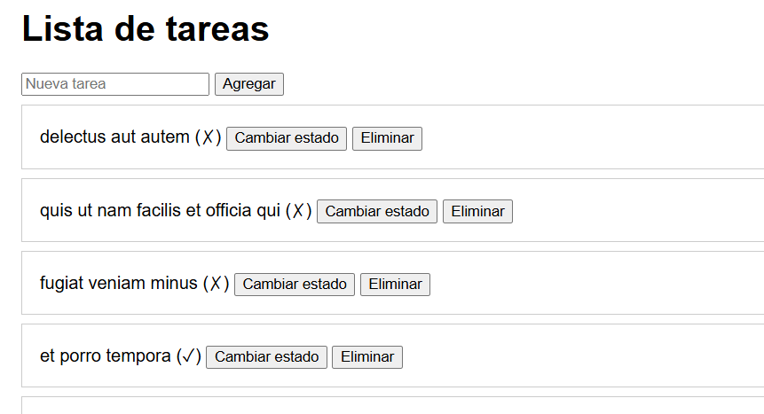

# Reto 52 - Cliente CRUD de tareas

## 🎯 Objetivo
Implementar operaciones CRUD contra una API REST usando fetch con métodos GET, POST, PATCH y DELETE.

## 🛠️ Requisitos
- Navegador web moderno (Chrome, Firefox, Edge).
- [Visual Studio Code](https://code.visualstudio.com/) y Live Server (recomendado para mejor experiencia).

## ▶️ Cómo ejecutar
### 🌐 Usando Live Server (recomendado)
1. Abre la carpeta del reto en VS Code.
2. Clic derecho en `index.html` → **Open with Live Server**.
3. Interactúa con la lista: agrega, cambia estado o elimina tareas.
> La API es de prueba (jsonplaceholder), los cambios no persisten realmente, pero simulan el flujo.

## 🧠 Decisiones y proceso de solución
- Creé una función request reutilizable que centraliza el manejo de JSON y errores.
- Para el DELETE, compruebo si la respuesta tiene contenido antes de parsear JSON, porque puede venir vacía.
- Usé delegación de eventos en el contenedor de lista para los botones de acción.
- Después de cada operación, refresco la lista para reflejar cambios.

## ⚠️ Dificultades encontradas
- Al principio la URL base tenía una barra al final y las peticiones GET fallaban (doble barra). La corregí eliminando la barra y añadiendo "/" al concatenar el ID.
- La API de jsonplaceholder no devuelve JSON en DELETE; tuve que manejar la respuesta vacía para evitar un error de parse.
- La delegación de eventos requirió usar e.target.closest('button') para encontrar el botón correcto.

## ✅ Pruebas realizadas
- [x] Agregar una tarea la muestra en la lista.
- [x] Cambiar estado alterna entre completado y pendiente.
- [x] Eliminar quita el elemento.
- [x] Si la API falla, se muestra un mensaje de error.

## 📸 Evidencia
*Reemplaza esta línea con la captura de pantalla después de ejecutar.*  
Navegador mostrando la lista de tareas con botones de acción.

---

> **Nota:** Este reto forma parte del manual de JavaScript 2026. Desarrollado siguiendo los criterios de aceptación.
